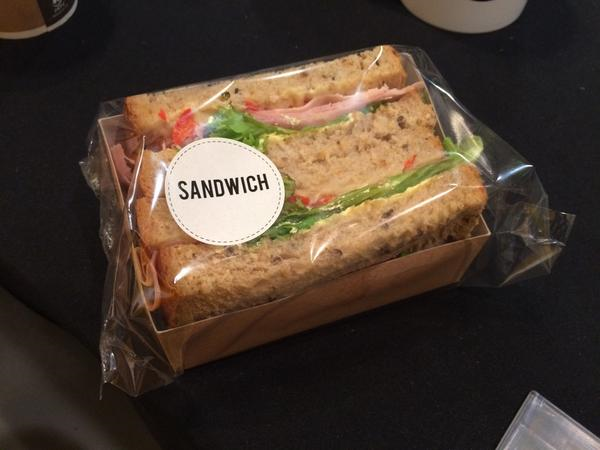
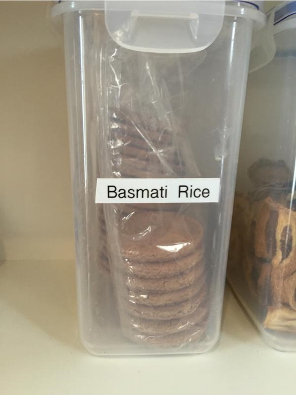

# Quelques remarques illustrées sur les commentaires

Le quatrième chapitre du livre [Clean Code](www.amazon.fr/Clean-Code-Handbook-Software-Craftsmanship/dp/0132350882) est consacré aux commentaires et il commence par la citation suivante de Brian W. Kernihan and P.J Plaugher : *Dont't comment bad code - rewrite it*

Et parce que de belles images valent mieux qu'un long discours !

## Overcommented Code
  
 Extrait de : [https://twitter.com/CiaranMcNulty/status/517654863623487488 ](https://twitter.com/CiaranMcNulty/status/517654863623487488)

## Code Comments
  
 Extrait de : [https://twitter.com/nzkoz/status/538892801941848064](https://twitter.com/nzkoz/status/538892801941848064)

## Code Comments
  
 Extrait de : [https://twitter.com/moh/status/659476321999818752 via https://twitter.com/wraithgar/status/601497059577987073](https://twitter.com/moh/status/659476321999818752)

### Continuez le tutoriel par quelques liens vers des [katas pour s'entraîner au refactoring](katas.md)  

