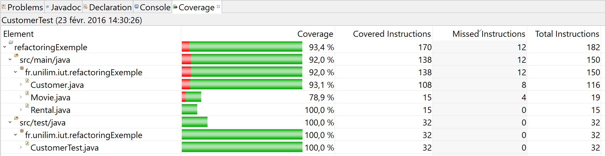
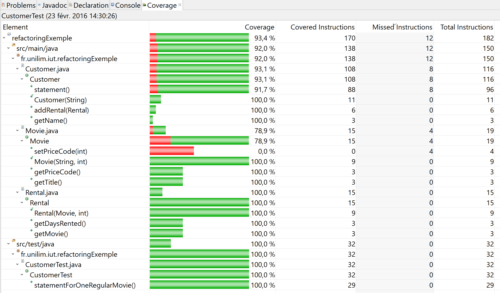
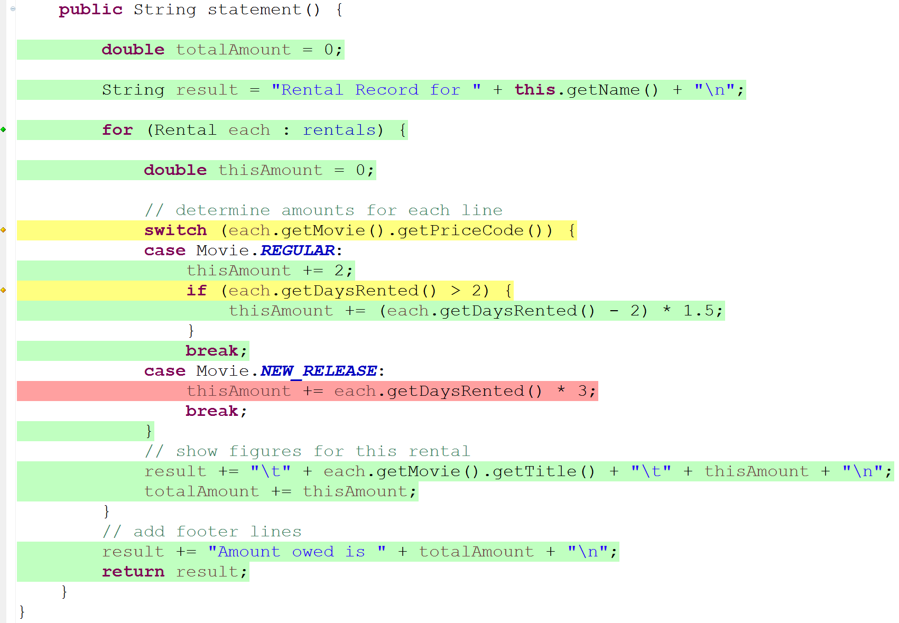
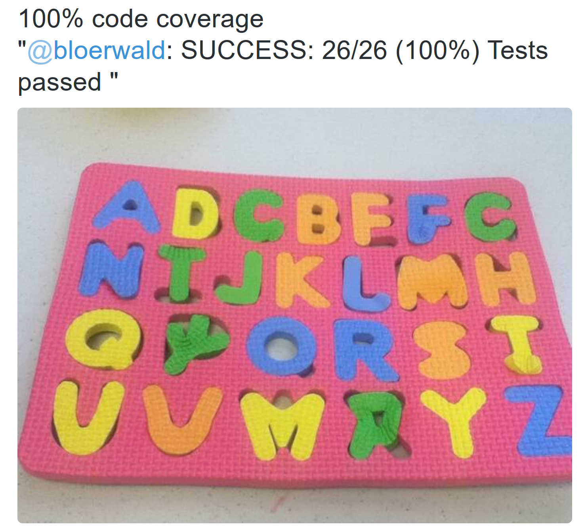

# Pas de refactoring sans test !

Rappelons la définition du refactoring :

> **[Un refactoring (remaniement) consiste à changer la structure interne d’un logiciel 
> sans en changer son comportement observable](http://refactoring.com/) *(M. Fowler)***

Pour garantir le comportement du système, il est donc indispensable, avant de procéder à un quelconque refactoring, de disposer d'un ensemble de tests automatisés. Ces tests serviront de *filet de sécurité* et permettront de remanier le code en toute sécurité : ce sont des tests de régression qui, pouvant être exécutés à tout moment, préviennent la non-régression du logiciel.

A ce propos, Martin Fowler préconise dans [Refactoring, Improving the Design of Existing Code](http://martinfowler.com/books/refactoring.html) :

> **Before you start refactoring, check that you have a solid suite of tests. These tests must be self-checking**

* [Quoi tester ?](#quoiTester)
* [Un premier test](#premierTest)
* [Connaître la couverture de code par les tests](#couverture)
* [Notre *harnais* de tests](#harnais)

## Quoi tester ? 

Le projet comporte 3 classes : `Movie`, `Rental` et `Customer`.

La classe `Movie` et la classe `Rental` sont simplement composées de constructeurs, getteurs et setteurs. Nous n'allons pas écrire de tests pour ses classes. En effet, nous ne cherchons par une couverture de code (par les tests) à 100% sur le projet, mais nous cherchons à écrire des tests qui permettent de garantir le comportement du système.

Nos tests porteront donc uniquement sur la classe `Customer` qui, via la méthode `statement`, contient le traitement relatif au calcul et à l'affichage du relevé de compte. C'est ce comportement que nous souhaitons  garantir et donc couvrir par nos tests.

Commencez par créer une classe de tests `CustomerTest.java`.  
<!-- Remarque : Si vous avez effectué [le tutoriel sur ObjectAid](https://github.com/iblasquez/tuto_ModelisationUML/tree/master/ObjectAid) pour installer le projet, vous disposez déjà de cette classe dans le répertoire `src/test/java`.-->

## Un premier test 

#### Propriétés d'un test

L'acronyme **FIRST** introduit par [Robert C. Martin](https://twitter.com/unclebobmartin) dans [Clean Code](www.amazon.fr/Clean-Code-Handbook-Software-Craftsmanship/dp/0132350882) rappelle les propriétés relatives à un *clean* test :

* ***F**ast* : rapide pour être fréquemment activé. 
* ***I**ndependent* : indépendant pour être exécuté de manière isolée des autres tests. 
* ***R**epeatable* :  reproductible pour être exécuté dans n'importe quel environnement. 
* ***S**elf-Validating* : auto-validant pour identifier rapidement le verdict
* ***T**imely* :  écrit au moment opportun

Pour respecter ces propriétés (notamment *Fast* et *Independent*), nous allons écrire dans notre classe de tests **une méthode de test pour chaque comportement du système à tester**.

Les bonnes pratiques de développement préconisent également de nommer les méthodes de tests de manière explicite. Les tests permettent de garantir le comportement, si un test échoue nous souhaitons comprendre rapidement d'où vient l'erreur afin de la corriger rapidement.
Le fait d'avoir **un test automatisé et bien nommé** permet de garantir la propriété (*Self-Validating*).  
Ainsi une méthode nommée `public void statementForOneRegularMovie()` ne vous parait-elle pas bien plus explicite qu'une méthode nommée `public void testOK()` ou `public void test1()`?  
*Remarque :* Un formalisme souvent utilisé pour nommer les méthodes de test est le suivant :  `public void testShouldReturnXWhenY`.

Pour le côté reproductible (*Repeatable*), nous allons automatiser nos tests avec le framework [Junit](http://junit.org/).

Quant au moment opportun (*Timely*), il se situe bien sûr pour nous AVANT de procéder au refactoring. 

#### Ecriture d'un test

Pour formater et structurer au mieux un test, le [pattern ***AAA***](http://c2.com/cgi/wiki?ArrangeActAssert) (***A***rrange ***A***ct ***A***ssert) est préconisé pour l'écriture d'un test.  
Ce patron décompose le test en trois étapes distinctes :
 
* ***A**rrange* : l'**initialisation** de l'acteur sous test c-a-d l'initialisation des objets nécessaires à l'exécution de la méthode à tester. 
* ***A**ct* : l'exécution de l'**action** à tester c-a-d l'appel de la méthode à tester. 
* ***A**ssert* : l'**assertion** sur la réaction de l'acteur c-a-d la vérification entre le comportement attendu et le comportement réel de la méthode à tester.

#### Un premier test relatif au comportement des vidéos de type `REGULAR`

Le premier test que nous souhaitons écrire va se focaliser sur un premier comportement simple, celui de la méthode `statement` pour la location d'une seule vidéo de type `REGULAR`.
La méthode de test relative à ce comportement est la suivante.

	import static org.junit.Assert.*;
	import org.junit.Test;

	public class CustomerTest {

		@Test
	    public void statementForOneRegularMovie() {
	    	Customer customer = new Customer("Alice");
	        Movie movie = new Movie("The Lord of the Rings", Movie.REGULAR);
	        Rental rental = new Rental(movie, 3); // 3 days rental
	        customer.addRental(rental);
	        
	        String statement = customer.statement();
	        
	        String expected = "Rental Record for Alice\n" +
	                "\tThe Lord of the Rings\t3.5\n" +
	                "Amount owed is 3.5\n";
	        assertEquals(expected, statement);
	    }
	}

Cette méthode a été écrite en trois parties suivant le [pattern ***AAA***](http://c2.com/cgi/wiki?ArrangeActAssert) :

* la partie ***A**rrange* permet d'instancier les objets `movie` et  `rental` pour construire un `customer` ayant loué depuis 3 jours une vidéo de type `REGULAR`.
* la partie ***A**ct* consiste à appeler la méthode `statement()` à tester.
* la partie ***A**ssert* consiste à comparer que la chaîne obtenue suite à l'exécution (`statement`) de la méthode est bien conforme à la chaîne attendue (`expected`).

Copiez ce code dans votre classe de test `CustomerTest.java` et exécutez le test unitaire afin de vérifier qu'il ***passe*** et que vos voyants sont bien au ***VERT*** !

Essayez de remplacer le `3.5` par `3.6` et relancez votre test afin de vérifier que cette fois-ci le test ***échoue*** et que vos voyants sont au ***ROUGE*** !  
Afin de continuer le tutoriel, remettez le test au VERT avec la valeur `3.5`.

#### Infinitest : un plug-in bien pratique pour tester en continu

Lors d'une phase de refactoring, on est amené à exécuter le plus fréquemment possible les tests unitaires afin de vérifier que les changements apportés au code ne *cassent* pas le comportement existant et pouvoir ainsi modifier son code en toute confiance.

[Infinitest](https://infinitest.github.io/) est un plugin s'intégrant au sein de l'IDE (Eclipse ou IntelliJ) qui permet de lancer automatiquement les tests quand un changement est détecté dans le code source c'est-à-dire à chaque fois que vous sauvegardez un fichier modifié. 

Ainsi, un simple `CTRL-S` permet de lancer automatiquement tous les tests unitaires du projet, et donc de tester de manière quasi-continue le code...

Pour installer [Infinitest](https://infinitest.github.io/), rien de plus simple, rendez-vous sur la page web du projet, tout est expliqué [ici](https://infinitest.github.io/).

## Connaître la couverture de code par les tests  

Avoir des tests c'est bien, connaître la couverture de code par ces tests peut parfois s'avérer interessant, pour savoir quels comportements sont bien couverts par les tests.

Pour connaître la couverture de code (Java Code Coverage) sous Eclipse, nous allons installer le plug-in [EclEmma](http://eclemma.org).  

####  Installation de EclEmma

Les différentes procédures d'installation du plug-in EclEmma sont décrites [ici](http://eclemma.org/installation.html).

Le plus simple est peut-être de choisir la première option et de **passer par l'Eclipse Marketplace** depuis le menu (`Help ->Eclipse Marketplace ...`).  
Recherchez ensuite `EclEmma` puis cliquez sur `Install` puis `Confirm` (en ayant vérifier au préalable que tout était bien coché).  
Il ne vous reste plus qu'à accepter la licence puis à cliquer sur `Finish`.  
Eclipse va ensuite redémarrer pour finaliser l'installation du plug-in.

Vous pouvez ensuite vérifier que votre installation s'est bien passée.
En effet, si tel est le cas, vous devez désormais disposer dans la barre d'outils de la vue Java du lanceur suivant :

####  Utilisation de EclEmma

##### Lancer la couverture de code

Pour visualiser la couverture à l'aide de EclEmma, il suffit d'utiliser le menu `Coverage As` proposé par le lanceur.

Placez-vous sur la classe `CustomerTest`.  
Grâce au lanceur d'EclEmma dans la barre d'outils, choisir  (`Coverage As -> JUnit Test`).

Une fois la couverture lancée, EclEmma va générer une nouvelle vue **Coverage View** disponible en bas de votre fenêtre de travail et **surligner le code selon un code couleur**.

*Remarque:* Vous pouvez en savoir plus sur le lancement de la couverture de code grâce à la rubrique [Launching in Coverage Mode](http://eclemma.org/userdoc/launching.html) du manuel utilisateur...

##### Zoom sur la Coverage View

La **Coverage View** permet d'obtenir un **taux de couverture** qui peut être plus ou moins détaillé :

* Exemple de la **Coverage View** se limitant aux taux de couvertures des classes :

* Exemple de la **Coverage View détaillée** allant jusqu'au taux de couverture des méthodes :

Nous constatons qu'avec le seul test `statementForOneRegularMovie`que nous venons d'écrire nous couvrons déjà 93% du code.  
Seule la méthode `setPriceCode()` n'est pas couverte.  
Quant à la méthode `statement()`, elle est déjà couverte à 91,7%.

*Remarque:* Vous pouvez en savoir plus sur la Coverage View grâce à la rubrique [Using the Coverage View](http://eclemma.org/userdoc/coverageview.html) du manuel utilisateur... 

##### Zoom sur la coloration du code Java 

Le couverture est également **visible directement dans le code** source java grâce à **un surlignage du code selon un code couleur**.  
Par défaut le code couleur est le suivant :

* un surlignage **VERT** pour montrer une **couverture totale** de la ligne de code par les tests unitaires
* un surlignage **JAUNE** pour montrer une **couverture partielle** de la ligne de code par les tests unitaires
* un surlignage **ROUGE** pour montrer une **absence de couverture** de la ligne de code par les tests unitaires.

Des **diamants colorés** apparaissent également à gauche de certaines lignes de code.  
Ce sont les lignes de code relatives à une instruction de décision (`if`, `switch`, `for`,..).
Le code couleur des diamants est identique à celui des lignes : vert pour une couverture totale, jaune pour une couverture partielle et rouge pour une absence de couverture.

Consultez la méthode `statement()` de la classe `Customer`. Vous devriez pour l'instant obtenir une coloration syntaxique similaire à la suivante.

En effet, un seul test a été écrit pour le moment : aucune couverture n'est donc encore prévue pour les vidéos de type `NEW_RELEASE` (absence de couverture => rouge) et la couverture pour les vidéos de type `REGULAR` peut être améliorée (notamment si le nombre de jours de location est inférieur à 2 et qu'il n'est pas nécessaire de passer dans le `if` : couverture partielle => jaune). 

*Remarque :* Le code couleur peut être personnalisé à partir du menu `Windows->preferences->General->Editors->Text Editors ->Annotations` et en modifiant les couleurs de `Full Coverage`, `Partial Coverage` et `No Coverage`.

*Remarque:* Vous pouvez en savoir plus sur la coloration syntaxique grâce à la rubrique [Source Code Annotation](http://eclemma.org/userdoc/annotations.html) du manuel utilisateur ...

##### En savoir plus sur l'utilisation du plug-in EclEmma
Le guide utilisateur du plug-in EclEmma est disponible [ici](http://eclemma.org/userdoc/index.html).

Pour en savoir un peu plus sur l'utilisation du plug-in EclEmma, vous pouvez consulter les articles suivants :

* [Plugin EclEmma](http://www.commentcamarche.net/faq/24822-plugin-eclemma)
* [EclEmma – Java Code Coverage for Eclipse](http://www.eclipse.org/community/eclipse_newsletter/2015/august/article1.php)

## Notre *harnais* de tests 

En tenant compte de la couverture actuelle de code de la méthode `statement`, il parait judicieux de rajouter dans notre classe `CustomerTest` au moins deux nouveaux tests :

* un premier test pour couvrir les vidéos de type `NEW_RELEASE` et transformer le surlignage rouge en surlignage vert...
* un second test pour transformer la couverture partielle des vidéos de type `REGULAR` (jaune) en couverture totale (verte).

#### Test relatif au comportement des vidéos de type `NEW_RELEASE`

Ecrivez un test, respectant le pattern AAA, permettant de se focaliser sur le comportement relatif à la location d'une seule vidéo de type `NEW_RELEASE`.  
Votre méthode de test pourrait, par exemple, être nommée : **`public void statementForOneNewReleaseMovie()`**

Une fois le test écrit, relancez votre couverture.

Vous pouvez alors comparer le test que vous avez écrit avec celui proposé [ici](#statementForOneNewReleaseMovie)

#### Test relatif au comportement d'une location de plusieurs vidéos

Arrivé(e) à ce point, il paraît interessant de tester le cas d'une location composée de plusieurs videos de types différents.
Pour jouer sur la couverture partielle du `if` de la méthode `statement`, il paraît nécessaire de tester une location de video de type `REGULAR` de moins de deux jours.

En respectant le pattern AAA et les remarques précédentes, nous pouvons par exemple proposer comme nouvelle méthode de test, la méthode suivante :

		 @Test
		    public void statementForManyMovies() {
		    	Customer customer = new Customer("Bob");
		        Movie movie1 = new Movie("Star Wars", Movie.NEW_RELEASE);
		        Rental rental1 = new Rental(movie1, 2); // 2 day rental
		        Movie movie2 = new Movie("The Lord of the Rings", Movie.REGULAR);
		        Rental rental2 = new Rental(movie2, 1); // 1 day rental
		        customer.addRental(rental1);
		        customer.addRental(rental2);
		        
		        String statement = customer.statement();
		        
		        String expected = "Rental Record for Bob\n" +
		                "\tStar Wars\t6.0\n" +
		                "\tThe Lord of the Rings\t2.0\n" +
		                "Amount owed is 8.0\n";
		        assertEquals(expected, statement);
		    }

Rajoutez cette méthode dans votre classe `CustomerTest` et relancez la couverture.  
Vous constatez que désormais, dans la méthode `statement` seul le `switch` relève d'une couverture partielle. En passant, sur le diamant jaune, vous pouvez visualiser la cause de cette couverture partielle : `1 of 3 branches missed.` ce qui signifie que la couverture pourrait être totale si on testait un autre type de vidéo, ce qui reviendrait à passer dans un `default`... Mais est-ce vraiment pertinent de tester un type autre que `NEW_RELEASE` et `REGULAR`...
La question que l'on peut alors se poser est donc de savoir si le `switch` est la *bonne* instruction à utiliser ici ? Nous y répondrons plus tard lors du refactoring...
Quoi qu'il en soit nous ne rajouterons pas de nouveau test dans notre harnais de tests et resterons (pour le moment) avec cette couverture partielle sur le `switch` puisque seuls les deux types de videos `NEW_RELEASE` et `REGULAR` peuvent être manipulés par notre programme.

#### Notre couverture AVANT le refactoring

Une fois les trois tests écrits, faites une petit bilan sur la couverture via la **Coverage View**. 
 
Le code source du projet est couvert à 97.3% de la manière suivante :

* La classe `Rental` est couverte à 100%
* La classe `Movie` est couverte à 78.9%, mais seule la méthode `setPriceCode()` n'est pas couverte. Comme il s'agit d'un setteur, nous ne chercherons pas à atteindre absolument les 100% de couverture pour cette classe et nous nous contenterons tout à fait de la couverture actuelle.
* La classe `Customer` est couverte à 100%, même si le `switch` met en évidence une couverture partielle (mais couverture tout de même...)

La couverture de notre projet semble donc tout à fait convenable pour commencer à refactorer notre code.  
Les tests couvrent complètement le comportement de la méthode `statement`.
Tous les tests passent au vert, et le challenge du refactoring va maintenant consister à remanier le code *sans casser les tests*...

#### Et pour finir quelques mots sur le taux de couverture ...

Il n'est pas pertinent de viser une couverture de 100%, sachant en outre que dans la pratique il est quasiment impossible d'atteindre les 100%.  
Une couverture autour de 80% est quant à elle tout à fait raisonnable.

En effet, une couverture élevée ne signifie pas nécessairement une bonne utilisation des tests comme le montre l'image ci-dessous extraite du [compte twitter de @francesc](https://twitter.com/francesc/status/449206943987793920) :

**En pratique, il est donc plus important de se focaliser sur la qualité des tests, putôt que sur le taux de couverture à atteindre.**  
Le taux de couverture doit juste être considéré comme un moyen d'améliorer la qualité globale du code et des tests pour le valider.   
D'ailleurs dans la partie précédente, la couverture nous a permis de réperer les tests *critiques* à effectuer (comportement de `statement` devant être couvert à 100% dans notre cas) et de ne pas trop nous attarder à écrire (ou à optimiser) des tests sur des parties de code peu sensibles (setteur dans notre cas).  
Vous pouvez retrouver ces réflexions et des liens autour de la couverture dans l'article [L’analyse de couverture de code en Java](http://blog.xebia.fr/2008/02/07/lanalyse-de-couverture-de-code-en-java/).  
Une article autour de la couverture de test est également proposé par Martin Fowler sur son blog : [ici](http://martinfowler.com/bliki/TestCoverage.html)

Maintenant que tout est prêt, nous allons enfin pourvoir commencer notre refactoring.
### Continuez le tutoriel par [isoler le calcul du montant des frais d'une location, de l'affichage du relevé (à l'aide d'un **`Extract method`**)](Refactoring_Step1_ExtractMethod.md)  

--- 

####  Un code de test possible pour la méthode `statementForOneNewReleaseMovie()`

		@Test
	    public void statementForOneNewReleaseMovie() {
	    	Customer customer = new Customer("Bob");
	        Movie movie = new Movie("Star Wars", Movie.NEW_RELEASE);
	        Rental rental = new Rental(movie, 3); // 3 day rental
	        customer.addRental(rental);
	        
	        String statement = customer.statement();
	        
	        String expected = "Rental Record for Bob\n" +
	                "\tStar Wars\t9.0\n" +
	                "Amount owed is 9.0\n";
	        assertEquals(expected, statement);
	    }

