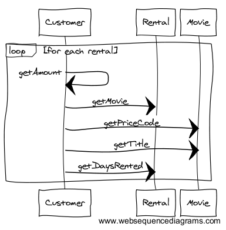

# Isoler le calcul du montant des frais d'une location, de l'affichage du relevé (à l'aide d'un **`Extract method`**)

En observant précédemment le code, nous avions remarqué que la méthode `statement()` de la classe `Customer` était un peu longue et qu'elle entremêlait le calcul du montant des frais d'une location et l'affichage du relevé de compte. Nous allons donc nous attacher dans cette première étape de refactoring à décomposer cette méthode en petites parties plus faciles à maintenir.

Pour cela, nous allons utiliser le pattern **Extract Method**. Ce pattern est un des plus utilisés dans les phases de refactoring. Il permet de *nettoyer* rapidement une méthode trop longue en la découpant en éléments plus simples.

Martin Fowler décrit ce pattern à l'adresse suivante : [http://refactoring.com/catalog/extractMethod.html](http://refactoring.com/catalog/extractMethod.html).  
Il préconise son usage lorsque :

> You have a code fragment that can be grouped together. 

Et propose de le mettre en place de la manière suivante :

> **Turn the fragment into a method whose name explains the purpose of the method.**

Ce premier refactoring autour du pattern **Extract Method** va s'organiser de la manière suivante :

* [Identifier le code à isoler](#identificationCode)
* [L'**`Extract Method`** via l'IDE (**`ALT+SHIFT+M`** sous Eclipse)](#extractMethodIDE)
* [Zoom sur le code généré lors de l'**`Extract Method`** : des paramètres aux variables locales...](#ParametreVariableLocale)
* [Un renommage plus explicite pour un code *plus propre* : **`Rename`** (**`ALT+SHIFT+R`**)](#renamingCleanCode)

Puis, nous continuerons par quelques liens pour :

* [Bien connaître son IDE : refactoring, raccourcis claviers, ...](#BienConnaitreIDE)

Et nous terminerons par jeter un petit coup d'oeil aux nouveaux diagrammes de notre projet :

* [Zoom sur les diagrammes UML (classes et séquences) après l'Extract Method](#diagUML)

## Identifier le code à isoler 

Pour simplifier la méthode `statement` de la classe `Customer`, nous allons commencer par isoler dans une méthode **`getAmount`**, le code propre au **calcul du montant des frais d'une location** 

Dans la méthode `statement()`, le code concerné par ce traitement est le code suivant, lié à l'instruction `switch`

		switch (each.getMovie().getPriceCode()) {
			case Movie.REGULAR:
				thisAmount += 2;
				if (each.getDaysRented() > 2) {
					thisAmount += (each.getDaysRented() - 2) * 1.5;
				}
				break;
			case Movie.NEW_RELEASE:
				thisAmount += each.getDaysRented() * 3;
				break;
			}

## L'**`Extract Method`** via l'IDE (**`ALT+SHIFT+M`** sous Eclipse) 

Pour mettre en place un **Extract Method** sous Eclipse, vous devez procéder de la manière suivante

* **sélectionner le code concerné par l'extraction** : rendez-vous donc dans la classe `Customer` et sélectionner le code ci-dessus (sans la ligne de commentaire).
* **appeler la fonction de refactoring Extract Method** : deux possibilités une fois que votre code est sélectionné :
	* soit un clic droit pour ouvrir le menu contextuel puis (**`Refactor -> Extract Method`**)
	* soit directement à l'aide du raccourci  clavier (**`ALT+SHIFT+M`**)
* **paramétrer votre Extract Method** en renseignant le nom de la méthode : `getAmount`

### Que se passe-t-il lors de l'exécution de l'Extract Method ?
Une nouvelle méthode **`private double getAmount(Rental each, double thisAmount)`** est alors créée dans la classe `Customer` : cette méthode encapsule le code sélectionné.

Un appel vers cette méthode est automatiquement généré dans votre code, à la place du code sélectionné (et cela dans tout le code c-a-d qu'en cas de duplication du code extrait, l'appel à la méthode générée sera également dupliquée).
Dans notre cas, un seul appel à la méthode est désormais présent pour l'instant. Il se trouve dans la méthode `statement()` sous la forme : **`thisAmount = getAmount(each, thisAmount);`**

> **Vous venez de faire une modification dans votre code...**  
> ***N'oubliez pas de relancer les tests pour vérifier que le comportement de votre code n'a pas changé !***

## Zoom sur le code généré lors de l'**`Extract Method`** : des paramètres aux variables locales... 

Lors d'un **Extract Method**, il est nécessaire de s'interroger sur la pertinence des paramètres d'entrée. En effet, une petite retouche du code généré peut parfois s'avérer nécessaire, notamment si un paramètre d'entrée est modifié dans le code de cette méthode ...

Par exemple, la méthode **`private double getAmount(Rental each, double thisAmount)`** générée via l'**Extract Method** possède actuellement deux paramètres d'entrée :

* **`each`** qui correspond à une location et qui n'est pas modifié par le code de la méthode.
* **`thisAmount`** qui correspond au montant. Mais le montant est modifié par le code de la méthode. A l'entrée de la méthode, ce montant doit toujours être initialisé à 0. **Le paramètre d'entrée doit typiquement dans ce cas être transformé en variable locale**. 
 
Il ne vous reste donc plus qu'à simplifier la signature de la méthode **`getAmount `** et à faire apparaître **`thisAmount`** en tant que variable locale (initialisée) afin d'obtenir un code similaire au suivant :

	private double getAmount(Rental each) { 
		double thisAmount = 0;

		switch (each.getMovie().getPriceCode()) {
		case Movie.REGULAR:
			thisAmount += 2;
			if (each.getDaysRented() > 2) {
				thisAmount += (each.getDaysRented() - 2) * 1.5;
			}
			break;
		case Movie.NEW_RELEASE:
			thisAmount += each.getDaysRented() * 3;
			break;
		}
		return thisAmount;
	}

N'oubliez pas non plus de modifier l'appel à la méthode **`getAmount `** ...

> **Vous venez de faire une modification dans votre code...**  
> ***N'oubliez pas de relancer les tests pour vérifier que le comportement de votre code n'a pas changé !***

## Un renommage plus explicite pour un code *plus propre* : **`Rename`** (**`ALT+SHIFT+R`**) 

***Bien nommer*** (variables, méthodes, classes, packages, ...) est une des premières *bonnes* pratiques de conception à respecter pour favoriser la lisibilité du code.  
[Robert C. Martin](https://twitter.com/unclebobmartin) a d'ailleurs fait de *Meaningful Names* le premier chapitre de son livre sur le [Clean Code](www.amazon.fr/Clean-Code-Handbook-Software-Craftsmanship/dp/0132350882) et Martin Fowler aime à rappeller dans [Refactoring, Improving the Design of Existing Code](http://martinfowler.com/books/refactoring.html) la citation suivante :

> **Any fool can write code that a computer can understand. Good programmers write code that humans can understand.**

***Les noms que vous utilisez doivent donc être assez explicites afin de révéler l'intention de votre code (son but).***

Nous allons faire en sorte maintenant que le code généré par l'**Extract Method** reste assez explicite.

#### A propos de la méthode `getAmount`

Un effort de **nommage** a déjà été réalisé en choisissant `getAmount`, puisque le but de  cette méthode est de **calculer le montant des frais d'une location**.

Le nom de cette méthode semble donc assez explicite pour le moment, et il n'est pas nécessaire d'y appliquer le pattern de refactoring [Rename Method](http://refactoring.com/catalog/renameMethod.html) qui préconise que si :

> The name of a method does not reveal its purpose.   
> Change the name of the method.

#### A propos des variables `each` et `thisAmount`

Les variables `each` et `thisAmount` étaient explicites dans la méthode `statement`.

Mais désormais elles apparaissent dans la méthode `getAmount` et leur nom ne révèle plus l'intention du code. Il est donc nécessaire de les renommer pour rendre explicite leur usage dans cette nouvelle portion de code. Par exemple : 

* `each`, qui correspond à une location, pourrait être renommé en `rental`
* `thisAmount`, qui correspond au résultat du traitement, pourrait être renommé `result`.

#### Renommage via Eclipse : **`Rename`** (**`ALT+SHIFT+R`**)

Le renommage est probablement le refactorig le plus utilisé. Les IDE proposent donc une fonction de refactoring de type **`Rename`** qui permet de renommer un élément sélectionné et qui est accessible sous Eclipse à partir du menu **`Refactor`** ou via le raccourci (**`ALT+SHIFT+R`**).

Pour renommer, la variable `each` en `rental` il suffit de sélectionner un `each` dans la méthode `getAmount`, puis d'appeler **`Rename`** (via **`ALT+SHIFT+R`** par exemple).  
Entrez ensuite le nouveau nom `rental` et toutes les variables `each` de la méthode `getAmount` sont simultanément renommer en `rental`.

Renommez de même la variable `thisAmount` en `result`.

 
> **Vous venez de faire des modifications dans votre code...**  
> ***N'oubliez pas de relancer les tests pour vérifier que le comportement de votre code n'a pas changé !***

#### Méthode `getAmount` à l'issue de ce premier refactoring
L'extraction du calcul du montant de la location semble désormais toucher à sa fin et le code de votre méthode `getAmount` devrait être à ce point du tutoriel similaire au suivant.

	private double getAmount(Rental rental) {
		double result = 0;
		switch (rental.getMovie().getPriceCode()) {
		case Movie.REGULAR:
			result += 2;
			if (rental.getDaysRented() > 2) {
				result += (rental.getDaysRented() - 2) * 1.5;
			}
			break;
		case Movie.NEW_RELEASE:
			result += rental.getDaysRented() * 3;
			break;
		}
		return result;
	}

Il est important de retenir que le refactoring doit se faire par petits pas en vérifiant constamment le comportement par les tests.   
Comme le dit Martin Fowler :

> **Refactoring changes the programs in small steps. If you make a mistake it is easy to find the bug**

*Remarque :* Lors de vos refactoring, n'hésitez pas de jeter un petit coup d'oeil à la [rubrique Refactoring du site Source Making](https://sourcemaking.com/refactoring) qui propose également un catalogue de refactorings permettant de revoir et/ou compléter ceux présentés sur [http://refactoring.com/catalog/](http://refactoring.com/catalog/)

## Bien connaître son IDE : refactoring, raccourcis claviers, ... 

Pour faciliter la tâche des développeurs, les IDE proposent de nombreuses fonctions de refactoring.   

Sous Eclipse, elles sont accessibles sous le menu **`Refactor`**, obtenu à partir de la barre d'outils, ou simplement à partir d'un clic droit depuis la zone de code à modifier.  
Des exemples de refactoring de base sous Eclipse sont donnés [ici](http://www.journaldunet.com/developpeur/tutoriel/jav/051208-java-eclipse-4-refactoring.shtml)

Pour être plus efficace lors d'un refactoring, il est conseillé d'utiliser les **raccourcis claviers**. Vous pouvez retrouver les plus courants dans [Eclipse : améliorer sa productivité grâce aux raccourcis clavier](http://blog.ippon.fr/2011/10/03/eclipse-ameliorer-sa-productivite-grace-aux-raccourcis-clavier/) et un mémento sur les raccourcis d'Eclipse : [ici](http://thierry-leriche-dessirier.developpez.com/tutoriels/eclipse/raccourcis/)  

En effet, maîtriser son IDE est indispensable à tout développeur, alors à l'occasion, jetez également un petit coup d'oeil sur [50 slides of IDE — Eclipse Con ](http://batmat.github.io/presentations/50-slides-of-ide/prez.html).

## Zoom sur les diagrammes UML (classes et séquences) après l'Extract Method

Et nous terminerons par un petit coup d'oeil aux nouveaux diagrammes de notre projet qui font désormais apparaître la méthode `getAmount`.

### Zoom sur le diagramme de classes après l'Extract Method 

### Zoom sur le diagramme de séquences après l'Extract Method 

### Continuez le tutoriel par [rendre la classe `Rental` responsable du calcul des frais de location (à l'aide d'un **`Move method`**)](refactoring_Step2_MoveMethod.md)

   
