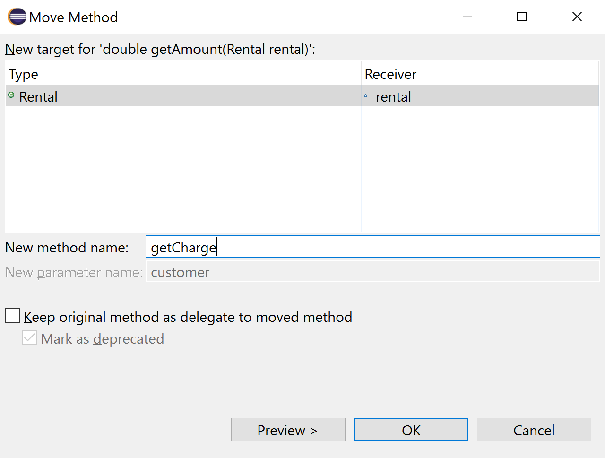
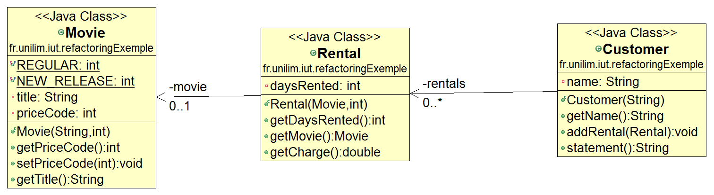
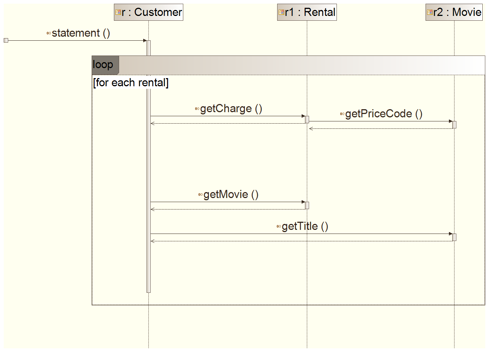
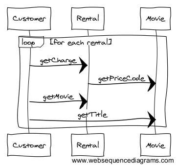

# Rendre la classe `Rental` responsable du calcul des frais d'une location (à l'aide d'un **`Move method`**) 

Repartons du diagramme de classe en cours et du code de la méthode `getAmount` :

En observant le code de la méthode `getAmount`, nous constatons que cette méthode n'utilise aucune information de la classe `Customer`, mais fait plutôt appel à des informations de la classe **`Rental`** à l'image de `rental.getMovie().getPriceCode()` et `rental.getDaysRented()`.

La question que l'on peut alors se poser est de savoir si cette méthode est actuellement définie dans la bonne classe (`Customer`) ?   
En effet, elle a la **responsabilité** d'évaluer les frais (*charge*) propres à une location (*rental*), ne devrait-elle pas être plutôt de la responsabilité de la location (**`Rental`**) ? ... ce qui nous amène à déplacer la méthode `getAmount` dans la classe **`Rental`** ...

Le pattern de refactoring associé à cette réflexion est le pattern **Move Method**. Il est décrit par Martin Fowler à l'adresse suivante : [http://refactoring.com/catalog/moveMethod.html](http://refactoring.com/catalog/moveMethod.html).  

Son usage est préconisé lorsque :

> A method is, or will be, using or used by more features of another class than the class on which it is defined. 

Sa mise en place consiste à :

>**Create a new method with a similar body in the class it uses most. Either turn the old method into a simple delegation, or remove it altogether.** 

Ce deuxième refactoring va donc s'organiser pas à pas autour du pattern **Move Method** de la manière suivante :

* [Les différentes étapes d'un **`Move Method`**](#MoveMethodEtapes)
* [Le **`Move Method`** via l'IDE (**`ALT+SHIFT+V`** sous Eclipse)](#MoveMethodIDE)

Puis, nous continuerons par un :

* [Zoom sur la *bonne pratique* **Inline Temp**](#InlineTemp)

Et nous terminerons par jeter un petit coup d'oeil aux nouveaux diagrammes de notre projet :

* [Zoom sur les diagrammes UML (classes et séquences) après le Move Method](#diagUML)

## Les différentes étapes d'un **`Move Method`** 

Si l'on devait procéder manuellement à la mise en place d'un **Move Method**, il faudrait suivre pas à pas les étapes suivantes (sans oublier de tester le comportement à la fin de chaque étape) :

* **Créer** une nouvelle méthode dans la classe `Rental` identique à `getAmount()`
* **Déleguer** le code de `getAmount()` à la nouvelle méthode
* **Remplacer** toutes les références à la méthode `getAmount()` par les références à la nouvelle méthode
* **Supprimer** `getAmount()`

Heureusement, les IDE vont grandement nous faciliter la tâche en nous proposant une fonctionnalité de refactoring **Move Method** réalisant déjà toutes ces tâches...

## Le **`Move Method`** via l'IDE (**`ALT+SHIFT+V`** sous Eclipse) 

Pour mettre en place un **`Move Method`** sous Eclipse, vous devez procéder de la manière suivante

* **sélectionner la méthode à déplacer** : pour cela, vous pouvez :  
	* soit directement sélectionner la signature de la méthode `getAmount()` dans le code source
	* soit sélectionner la méthode `getAmount()` via la vue Outline (peut-être plus pratique)
* **appeler la fonction de refactoring Move Method** : deux possibilités :
	* soit un clic droit pour ouvrir le menu contextuel puis (**`Refactor -> Move...`**)
	* soit via le raccourci  clavier (**`ALT+SHIFT+V`**)
* **paramétrer votre Move Method** 
	* vérifier la nouvelle **classe** cible : **`Rental`** sera le **Type** du **New target** dans notre cas.
	* renseigner le **nom de la nouvelle méthode**. Rappelons que ce nom doit être explicite dans la classe où la méthode sera définie et doit **montrer l'intention du code**. Nous décidons donc d'appeler la méthode **`getCharge`**, puisque ce code permet de calculer les frais (*charge*) propres à une location (*rental*).
	* paramétrer l'**option `Keep original method as delegate to moved method`**. Dans notre cas, **cette case ne doit pas être cochée** . En effet, nous souhaitons que la méthode `getAmount` disparaisse de notre code et que le **Move Method** d'Eclipse réalise automatiquement les 4 étapes présentées précedemment (si la case était cochée le code de cette méthode serait alors délégué à la méthode `getCharge`).

Vous pouvez alors cliquer sur **`OK`**.  
Un message vous informe que le **Move Method** va avoir un impact sur la visibilité de la méthode. Elle était `private` dans la classe `Customer` et passe à *package* dans la classe `Rental` (ce qui est normal puisqu'elle est utilisée dans le `statement` de la classe `Customer`).  
Vous pouvez donc cliquer sur **`Continue`** et sauvegarder.

> **Vous venez de faire une modification dans votre code...**  
> ***N'oubliez pas de relancer les tests pour vérifier que le comportement de votre code n'a pas changé !*** 

### Que s'est-il passé lors de l'exécution du Move Method ?

L'IDE a automatiquement exécuté les 4 étapes : **Créer**, **Déleguer**, **Remplacer** et
**Supprimer**.

Jetons un petit coup d'oeil au code pour confirmer :

* **Dans la classe `Rental`** : **la présence d'une méthode `getCharge`** contenant le code de `getAmount`. Rajoutez `public` pour une visibilité publique, sa signature devient donc : **`public double getCharge()`**

* **Dans la classe `Customer`** :
	*  **la dispartition de la méthode `getAmount`**
	*  **l'appel à la méthode `getCharge`** dans le code de la méthode `statement` :  `thisAmount = getAmount(each); ` étant devenu un `thisAmount = each.getCharge();`

> **Vous venez de faire une petite modification dans votre code...**  
> ***N'oubliez pas de relancer les tests pour vérifier que le comportement de votre code n'a pas changé !***

## Zoom sur la *bonne pratique* **Inline Temp** 

En observant le code de la méthode `statement`, nous pouvons remarquer la redondance de `thisAmount` qui n'est pas modifié après son affectation.

Dans un tel cas, le pattern **Inline Temp**, décrit par Martin Fowler à l'adresse suivante  [http://refactoring.com/catalog/inlineTemp.html](http://refactoring.com/catalog/inlineTemp.html), est préconisé :  

> You have a temp that is assigned to once with a simple expression, and the temp is getting in the way of other refactorings.

Sa mise en place consiste à :

>**Replace all references to that temp with the expression.** 

### Pourquoi remplacer une variable temporaire par un appel de méthode est-il considéré comme une *bonne* pratique ?

Si on est sûr que cette variable temporaire ne sera pas modifiée dans le code, appeler la méthode à sa place permet d'éviter toute modification intempestive (dans le cas d'un code plus long) ...

L'emploi de ce pattern permet également d'améliorer la **lisibilité du code** : l'expression `each.getCharge()` (frais de location) n'est-elle pas plus explicite qu'un simple `amount` (montant de quoi?) ?  

Appeler une méthode au lieu d'une variable peut néammoins soulever le problème des **performances**. Ici le code est simple et le problème ne se pose pas vraiment. Toutefois, si un tel problème apparaissait plus tard, il serait toujours possible d'optimiser la méthode `getCharge()`, et cela d'autant plus facilement que le code de cette méthode a *bien* été refactoré.

**Précaution d'utilisation** : Il est à noter que la mise en place d'un tel pattern n'est toutefois possible que lorsque la variable temporaire n'est soumise qu'à une seule affectation dans le bloc de code à refactorer (comme c'est le cas ici) et qu'elle ne cause pas d'effets de bords (c-a-d que l'appel de la méthode ne modifie l'état d'aucun objet).

### Le Inline Temp via l'IDE (**`ALT+SHIFT+I`** sous Eclipse)

Le but de notre refactoring est donc supprimer la variable temporaire `thisAmount` et de la remplacer directement par des appels à la méthode `getCharge()`. Le **Inline Temp** va être réalisé sous Eclipse à l'aide de la fonction de refactoring **`Inline...`**

Sélectionnez `thisAmount` dans le code et appelez la fonction de refactoring **`Inline...`** :

* soit via un clic droit pour ouvrir le menu contextuel puis (**`Refactor -> Inline...`**)
* soit directement à l'aide du raccourci clavier (**`ALT+SHIFT+I`**)

Il se peut qu'un message d'erreur indique alors que la variable `thisAmount` est affectée plus d'une fois si votre code contient les deux instructions suivantes :
`double thisAmount = 0;` et `thisAmount = each.getCharge();`.

L'intialisation `thisAmount=0;` étant devenue inutile (peut-être l'aviez-vous déjà vu lors de l'`Extract Method`), nous pouvons supprimer cette instruction et transformer `double thisAmount = each.getCharge();` afin de pouvoir relancer un (**`Refactor -> Inline...`**) sur `thisAmount`.

Le code du `for (Rental each : rentals)` se réduit donc désormais aux deux ligne suivantes :

	result += "\t" + each.getMovie().getTitle() + "\t" + each.getCharge() + "\n";
	totalAmount += each.getCharge();

> **Vous venez de faire une petite modification dans votre code...**  
> ***N'oubliez pas de relancer les tests pour vérifier que le comportement de votre code n'a pas changé !***

Remarque : Il est à noter que Source Making décrit également le pattern **Inline Temp** : [ici](https://sourcemaking.com/refactoring/inline-temp)

## Zoom sur les diagrammes UML (classes et séquences) après le Move Method

Et nous terminerons par un petit coup d'oeil aux nouveaux diagrammes de notre projet.

### Zoom sur le diagramme de classes après le Move Method 

Notons la disparition de la méthode `getAmount` de la classe `Customer` et donc l'appaition de la méthode `getCharge` dans la classe `Rental`, ce qui a l'effet suivant sur le diagramme de séquence ... 

### Zoom sur le diagramme de séquences après le Move Method 

<!--  -->

### Continuez le tutoriel par [isoler le calcul de la somme des frais de toutes les locations de l’affichage du relevé (à l'aide d'un **`Replace Temp with Query`**)](refactoring_Step3_ReplaceTempWithQuery.md) 

