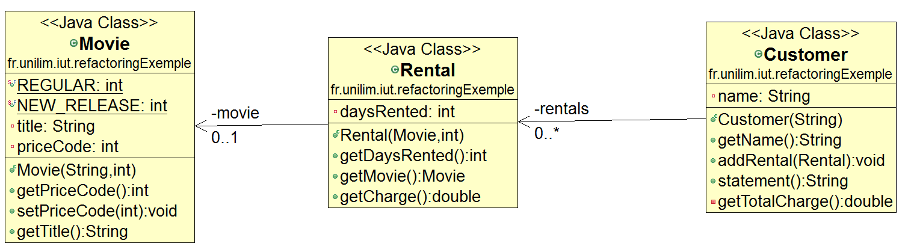
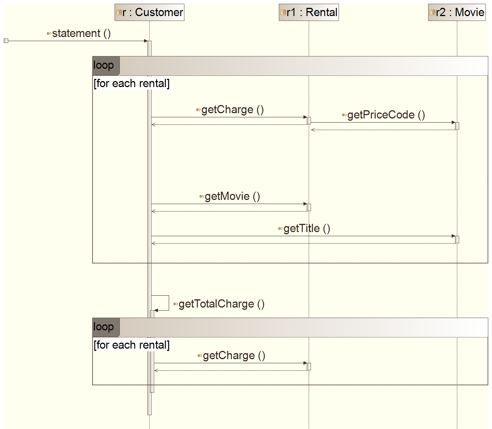
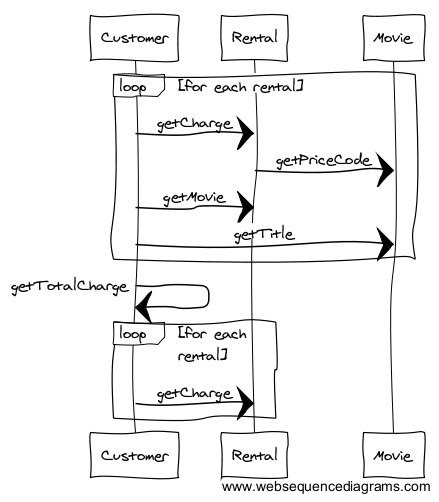

# Isoler le calcul de la somme des frais de toutes les locations de l’affichage du relevé (à l'aide d'un **`Replace Temp with Query`**)

Repartons de la méthode `statement` de la classe `Customer` :

	public String statement() {

		double totalAmount = 0;

		String result = "Rental Record for " + this.getName() + "\n";

		for (Rental each : rentals) {

			// determine amounts for each line
			// show figures for this rental
			result += "\t" + each.getMovie().getTitle() + "\t" + each.getCharge() + "\n";
			totalAmount += each.getCharge();
		}
		// add footer lines
		result += "Amount owed is " + totalAmount + "\n";
		return result;
	}

Ne pourrait-on pas encore améliorer la méthode `statement` avant l'ajout de la nouvelle fonctionnalité ? 

Nous pouvons constater que cette méthode contient une variable temporaire : `totalAmount`, utilisée pour calculer **et** afficher le montant total de tous les frais de location d'un même client.
Le calcul de tous les frais de location ne pourrait-il pas être isolé de l'affichage du relevé ? ...     
D'autant plus que l'affichage au format actuel (**ASCII**  via la méthode `statement`) et l'affichage au format à venir (**HTML** via une future méthode `htmlStatement`) nécessiteront tous deux de disposer à moment donné de la valeur de ce montant pour l'inclure dans leur relevé respectif.

Pour ce faire, ne serait-il pas intéressant que la classe `Customer` puisse proposer à ses clients une méthode permettant de connaitre le montant total de tous leurs frais de location ?
Et nommer cette méthode `getTotalCharge()` ne permettrait-il pas d'insister sur son intention ?

Ce troisième refactoring va donc permettre, au travers des étapes suivantes, de transformer la variable temporaire `totalAmount` en méthode `getTotalCharge()` afin d'***Inliner*** cette dernière :

* [Extraction de la méthode `getTotalCharge()`](#ExtractMethod)
* [Mise en *Inline* de la variable temporaire `totalAmount`](#InlineTemp)

Le pattern de refactoring mis en oeuvre n'est alors autre que **Replace Temp With Query**, qui est en réalité une implementation un peu plus complexe du pattern **Inline Temp** :

* [Zoom sur le pattern **Replace Temp With Query**](#ReplaceTempWithQuery)

Et nous terminerons par jeter un petit coup d'oeil aux nouveaux diagrammes de notre projet et sur la couverture :

* [Zoom sur les diagrammes UML (classes et séquences) après le Replace Temp With Query](#diagUML)
* [Zoom sur la couverture de code](#couverture)

## Extraction de la méthode `getTotalCharge()`

Pour extraire la méthode `getTotalCharge()`, il n'est pas possible d'utiliser directement la fonctionnalité  de refactoring **Extract Method** proposée par l'IDE et utilisée lors du premier refactoring.
En effet la variable `totalAmount` est inclus dans une boucle `for (Rental each : rentals)` qui traite à la fois du calcul du montant (en modifiant `totalAmount`), mais aussi de l'affichage de ce montant (en modifiant `result`).

Nous devons donc dans un premier temps isolé les deux traitements : l'affichage (avec `result`) et le calcul ( avec `totalAmount`) pour pouvoir appliquer un **Extract Method** sur un code focalisé uniquement sur `totalAmount`.

### Dupliquer le code (un mal parfois nécessaire) pour mieux extraire ...

L'isolation des traitements nécessite d'en passer au préalable par une duplication de code.
  
**Copier/coller le code du `for (Rental each : rentals)`** de manière à obtenir les deux instructions l'une en dessous de l'autre.  

* Considérez que le **premier `for`** traite uniquement de l'**affichage** et ne conservez que l'instruction correspondante.

* Considérez que le **second `for`** traite uniquement du **calcul** du montant total des frais de location et ne conservez que l'instruction correspondante. Déplacez l'instruction **`double totalAmount = 0;`** au dessus de ce second `for` pour faciliter l'extraction.

Remarques :

* Profitez également de cette étape **pour supprimer les commentaires** dans les `for`. En effet, si votre code est assez *petit* et si les noms de variables et méthodes assez explicites pour montrer l'intention du code, est-il vraiment pertinent de le surcharger avec des commentaires ? A ce propos, jetez un petit coup d'oeil sur la partie sur le partie [Quelques remarques illustrées sur les commentaires](commentaires.md) ...

* Zoom sur *Bien connaître sons IDE* (Eclipse) : 
	* **Connaissez-vous les raccourcis claviers qui permettent de déplacer une(des) lignes de code (en respectant l'indentation) ?**  Placez-vous sur la ligne de l'instruction `double totalAmount = 0;` et déplacez-la à l'aide de **`ALT+HAUT`** et **`ALT+BAS`**. Ce raccourci marche aussi pour plusieurs lignes à la fois. A noter : (**`SHIFT+BAS`**) pour sélectionner plusieurs lignes et (**`ALT+SHIFT+DROITE`**) pour sélectionner tout un élément de code,...

	* N'oubliez pas qu'à tout moment vous pouez avoir accès à la liste des raccourcis avec **`CTRL+SHIFT+L`**. 

	* Et n'oubliez pas de reformater votre code après toutes ces modifications.
	
		* **`CTRL+SHIFT+F`** : qui n'est autre que le menu (`Source -> Format`) et qui permet d'effectuer un formatage selon les règles configurable dans les préférences `Window -> Preferences -> Java -> Code Style ->Formatter`

		* **`CTRL+I`** : qui n'est autre que le menu (`Source -> Correct Indent`) et qui se limite à l’indentation du code sélectionné.

Votre code doit être similaire au suivant :

	public String statement() {

		String result = "Rental Record for " + this.getName() + "\n";

		for (Rental each : rentals) {
			result += "\t" + each.getMovie().getTitle() + "\t" + each.getCharge() + "\n";
		}

		double totalAmount = 0;
		for (Rental each : rentals) {
			totalAmount += each.getCharge();
		}

		// add footer lines
		result += "Amount owed is " + totalAmount + "\n";
		return result;
	}

> **Vous venez de faire des modifications dans votre code...**  
> ***N'oubliez pas de relancer les tests pour vérifier que le comportement de votre code n'a pas changé !***

### **Extract Method** via l'IDE 

Après avoir sélectionner tout le code relatif au calcul de `totalAmount`, vous pouvez procéder à l'extraction de la méthode `getTotalCharge()`, via le raccourci clavier (**`ALT+SHIFT+M`**) par exemple.

Et renommez ensuite la variable `totalAmount` en `result` ou même en `totalCharge` pour plus d'expressivité (**`ALT+SHIFT+R`**), puisque cette variable représente désormais le total des frais calculé dans `getTotalCharge()`.

> **Vous venez de faire des modifications dans votre code...**  
> ***N'oubliez pas de relancer les tests pour vérifier que le comportement de votre code n'a pas changé !***

## *Inliner* la variable locale `totalAmount` avec `getTotalCharge` 

Pour terminer le refactoring **Replace Temp With Query**, il ne reste plus qu'à *inliner* la variable `totalAmount` de la méthode `statement` (**`ALT+SHIFT+I`**) et à supprimer le dernier commentaire.

Vous devriez alors obtenir pour les méthodes `statement` et `getTotalCharge` de la classe `Customer` un code similaire au suivant :

	public String statement() {

		String result = "Rental Record for " + this.getName() + "\n";

		for (Rental each : rentals) {
			result += "\t" + each.getMovie().getTitle() + "\t" + each.getCharge() + "\n";
		}

		result += "Amount owed is " + getTotalCharge() + "\n";
		return result;
	}

	
	private double getTotalCharge() {
		double totalCharge = 0;
		for (Rental each : rentals) {
			totalCharge += each.getCharge();
		}
		return totalCharge;
	}

> **Vous venez de faire des modifications dans votre code...**  
> ***N'oubliez pas de relancer les tests pour vérifier que le comportement de votre code n'a pas changé !***

## Zoom sur le pattern **Replace Temp With Query**

Le pattern **ReplaceTempWithQuery** est décrit par Martin Fowler à l'adresse suivante : [http://refactoring.com/catalog/replaceTempWithQuery.html](http://refactoring.com/catalog/replaceTempWithQuery.html).  

Son usage est préconisé lorsque :

> You are using a temporary variable to hold the result of an expression.

Sa mise en place consiste à :

>**Extract the expression into a method. Replace all references to the temp with the expression. The new method can then be used in other methods.** 

La rubrique [**Replace Temp with Query** du site Refactoring](http://refactoring.com/catalog/replaceTempWithQuery.html) relève aussi comme avantages de cette bonne pratique :
**une meilleure lisibilité du code** et une aide pour procéder éventuellement plus tard à refactoring de simplification de code en cas de duplication ...

**Précaution d'utilisation** : Comme pour l'**Inline Temp**, la mise en place de **Replace Temp with Query** n'est toutefois possible lorsque la variable temporaire n'est soumise qu'à une seule affectation dans le bloc de code à refactorer et qu'elle ne cause aucun effet de bords.

## Zoom sur les diagrammes UML (classes et séquences) après le Replace Temp With Query

Et nous terminerons par jeter un petit coup d'oeil aux nouveaux diagrammes de notre projet qui font désormais apparaître la méthode `getTotalCharge` dans la classe `Customer`

### Zoom sur le diagramme de classes après le Replace Temp With Query 

### Zoom sur le diagramme de séquences après le Replace Temp With Query

<!--  -->

**Quid des performances ?**
Ce diagramme de séquences peut vous interroger sur la question des performances, puisqu'on y voit apparaître deux boucles et des appels à `getCharge` (qui contient également une boucle).
En l'état actuel des choses, on ne peut pas savoir combien de fois les boucles seront exécutées et surtout si elles seront excéutées un nombre de fois suffisant pour affecter les performances du système. Si tel est le cas, le code pourra toujours être optimisé plus tard, et ce d'autant plus facilement que le code est *bien* refactoré...

**Mais pour l'instant, grâce au dernier refactoring sur la méthode `getTotalCharge`, tout semble désormais prêt pour ajouter facilement la nouvelle fonctionnalité relative à l'affichage du relevé de compte du client au format HTML.**

Nous allons donc interrompre (momentanément) notre refactoring pour procéder à cet ajout, mais avant cela, jetons un petit coup d'oeil sur la couverture de code.

## Zoom sur la couverture de code 

Lancer la couverture à l'aide de EclEmma, en vous plaçant sur la classe `CustomerTest`, puis en sélectionnant (`Coverage As -> JUnit Test`).

La **Coverage View** permet de faire un petit bilan sur la couverture actuelle.

Au niveau des classes, les taux de couverture sont identiques :

* La classe `Customer` est couverte à 100% (la couverture partielle a disparu puisque le `switch` a été déplacé dans la classe `Rental`)
* La classe `Rental` est couverte à 100% (avec une couverture partielle due au `switch`) 
* La classe `Movie` est couverte à 78.9% 

<!-- Quid du nombre de lignes de code ? .... -->
Au niveau du code source global du projet, le taux de couverture est actuellement de 97.6%, contre 97.3% avant le refactoring.  
Cette légère différence s'explique surement par le fait que ce refactoring nous a amené à augmenter le nombre de lignes de code (notamment par la duplication de la boucle `for`), mais le code supplémentaire étant couvert, il augmente légèrement le taux de couverture global.

*Remarque:* Il est à noter qu'habituellement dans un vrai projet, un refactoring permet, en plus d'améliorer la maintenance et la lisibilité du code, de réduire le nombre de lignes de code ...mais nous sommes ici dans un cas simple...

### Continuez le tutoriel par [Mettre en place le nouvel affichage au format HTML via la méthode `htmlStatement`](refactoring_Step4_Ajout_htmlStatement.md)  