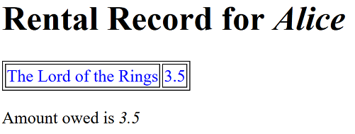
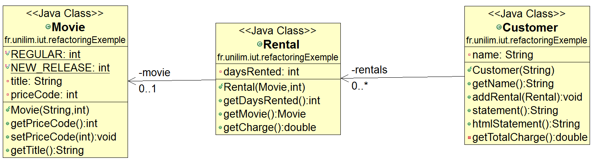

# Mettre en place le nouvel affichage au format HTML via la méthode `htmlStatement`

Tout est désormais prêt pour ajouter facilement la nouvelle fonctionnalité relative à **l'affichage du relevé de compte du client au format HTML**.  
Cette fonctionnalité sera ajoutée à notre programme via la méthode **`htmlStatement`** en deux temps :

* [Mise en place du code source de la méthode `htmlStatement`](#htmlStatementCode)
* [Mise en place de tests sur la méthode `htmlStatement`](#htmlStatementTests)

Et nous terminerons par jeter un petit coup d'oeil aux nouveaux diagrammes de notre projet :

* [Zoom sur le diagramme de classes après l'ajout de l'affichage au format HTML](#diagUML)

## Mise en place du code source de la méthode `htmlStatement`

Suite au refactoring précédent, il est désormais facile d'ajouter *proprement* la méthode `htmlStatement` à notre code.  

Comme la méthode `statement`, la méthode `htmlStatement` sera de la responsabilité de la classe `Customer`.  
Commencez donc par copier-coller la méthode `statement` en `htmlStatement`, puis apportez les modifications nécessaires pour générer un bout decode HTML qui permet (une fois inséré dans un fichier de type [`statement.html`](statement.html)) de proposer un affichage similaire au suivant :

<!-- Bout de code HTML testé sur : www.w3schools.com -->

Pour ce faire, le code de votre méthode `htmlStatement` devrait se rapprocher du code suivant :

	public String htmlStatement() {

		String result = "<h1>Rental Record for <em>" + this.getName() + "</em></h1>
\n";

		result +="<table><tboby>";
		for (Rental each : rentals) {
			result +=  "<tr><td>"+each.getMovie().getTitle() + "</td><td>" + each.getCharge() + "</tr></td>";
		}
		result +="</table></tboby>";

		result += "
Amount owed is <em>" + getTotalCharge() + "</em>
\n";
		return result;
	}

> **Vous venez de faire des modifications dans votre code...**  
> ***N'oubliez pas de relancer les tests pour vérifier que le comportement de votre code n'a pas changé !***

Les tests sont verts, mais ils ne concernent que la méthode `statement` et le comportement de la méthode `htmlStatement` n'est pas encore testé...
Si vous relancez la couverture de code sur la classe `Customer`, vous constaterez que le taux de couverture du code source du projet est passé à 67.1% (au lieu de 97.6% précédemment) et que le taux de couverture de la classe `Customer` est passé 56.5% (au lieu de 100% précédemment).   
Nous allons donc ajouter des tests pour pouvoir continuer à travailler sur le code de ce projet en toute confiance.

## Mise en place de tests sur la méthode `htmlStatement`

Copiez-Collez le premier test `statementForOneRegularMovie` et adaptez le `htmlStatementForOneRegularMovie`.

*Astuce :* Pour faire passer rapidement le test au vert et compléter sans trop réfléchir le `expected`, vous pouvez procédez de la manière suivante. 
Après le copier/coller, transformer tous les `statement` en `htmlStatement`. Excéutez votre test. Il échoue, ce qui est normal puisque nous n'avons pas encre modifié le `expected`. Allez-voir dans la **Failure Trace** de la vue **Junit** pourquoi votre test échoue (pour cela il faut lancer le test `Run as -> Junit Test`). Pour comparer la valeur entre le résultat réel et le résultat attendu à l'aide d'un clic droit, sélectionnez (`Compare Result`).
Il ne vous reste plus qu'à copier la  valeur attendue (`Actual`) et à la coller comme valeur de votre valeur `expected`. Vous n'avez plus qu'à relancer le test.
Il se peut que vous devriez retoucher les retours à la ligne en `\n` pour que le test passe au vert, puisque l'assertion consiste à comparer des chaînes de caractères.

Vous devriez obtenir un code de test similaire au suivant :

	@Test
	public void htmlStatementForOneRegularMovie() {
		Customer customer = new Customer("Alice");
		Movie movie = new Movie("The Lord of the Rings", Movie.REGULAR);
		Rental rental = new Rental(movie, 3); // 3 day rental
		customer.addRental(rental);

		String htmlStatement = customer.htmlStatement();

		String expected = "<h1>Rental Record for <em>Alice</em></h1>
\n"
				+ "<table><tboby><tr><td>The Lord of the Rings</td><td>3.5</tr></td></table></tboby>"
				+ "
Amount owed is <em>3.5</em>
\n";
		assertEquals(expected, htmlStatement);
	}

Relancez la couverture (`Coverage As -> JUnit Test`) sur la classe `CustomerTest`.
Elle est revenue à 100% sur la classe `Customer` puisque tout le code de la méthode `htmlStatement` est désormais couvert par ce test (c-a-d le formattage HTML), les tests précédents couvrant déjà le calcul des frais de location.

Ce test est donc suffisant pour couvrir le nouveau comportement ajouté dans notre programme. 

## Zoom sur le diagramme de classes après l'ajout de l'affichage au format HTML

Et nous terminerons par jeter un petit coup d'oeil au nouveau diagramme de classes de notre projet qui fait désormais apparaître la méthode `htmlStatement` dans la classe `Customer`

*Remarque:* Les diagrammes de séquences des méthodes `statement` et  `htmlStatement` sont identiques puisque nous avons juste modifié l'affichage.

*Remarque:* Il serait encore possible d'améliorer ce refactoring en extrayant des méthodes pour le *header*, *footer* et les *détails* de l'affichage et en mettant en place un **Form template Method** sur ces méthodes (décrit [ici](http://refactoring.com/catalog/formTemplateMethod.html) et [là](https://sourcemaking.com/refactoring/form-template-method)).  
Nous ne mettrons pas en place ce refactoring pour le moment car nous souhaitons **répondre en priorité à un nouveau besoin de notre client.** Il souhaite pouvoir changer, dans un futur proche, la façon dont il classifie ses vidéos mais il ne connaît pas exactement ce classement.
Il sait cependant que ces changements modifieront la tarification des vidéos et que cette dernière sera étendue au delà des deux tarifs actuels (*`REGULAR`* et *`NEW_RELEASE`*).

### Continuez le tutoriel par [Déléguer la gestion des règles de tarification à la vidéo](refactoring_Step5_DeleguerGetCharge.md)

