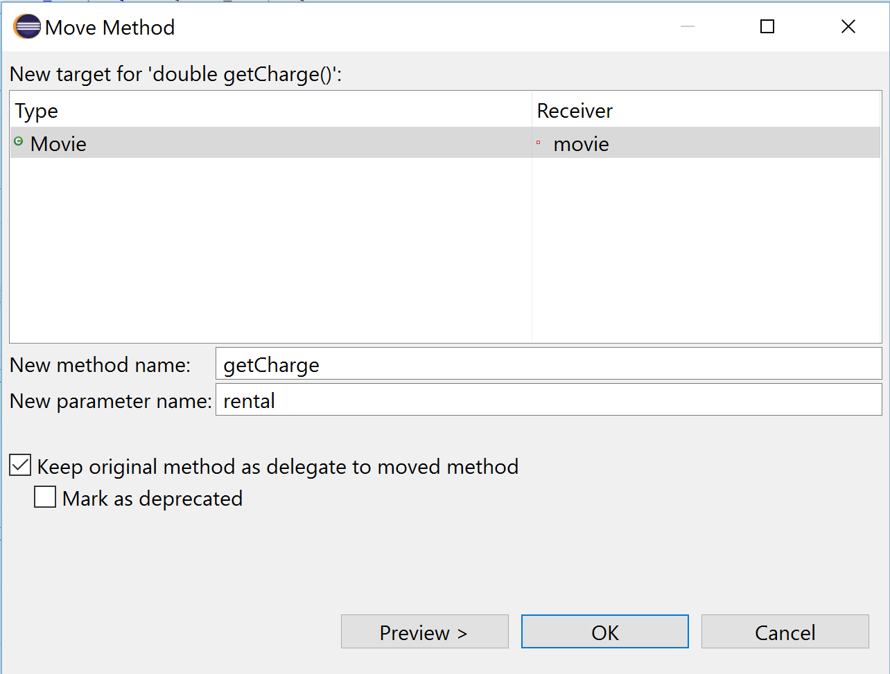
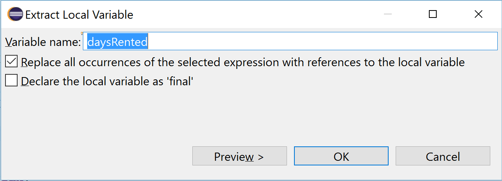
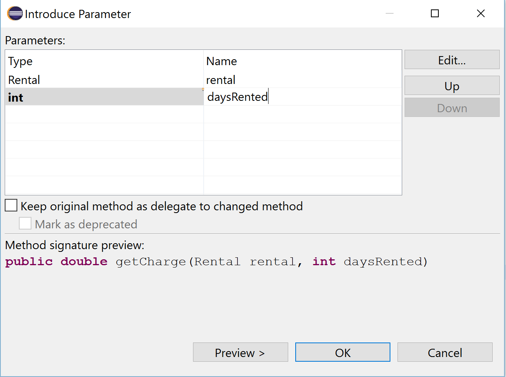
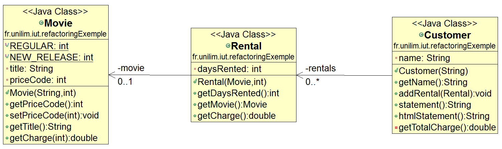
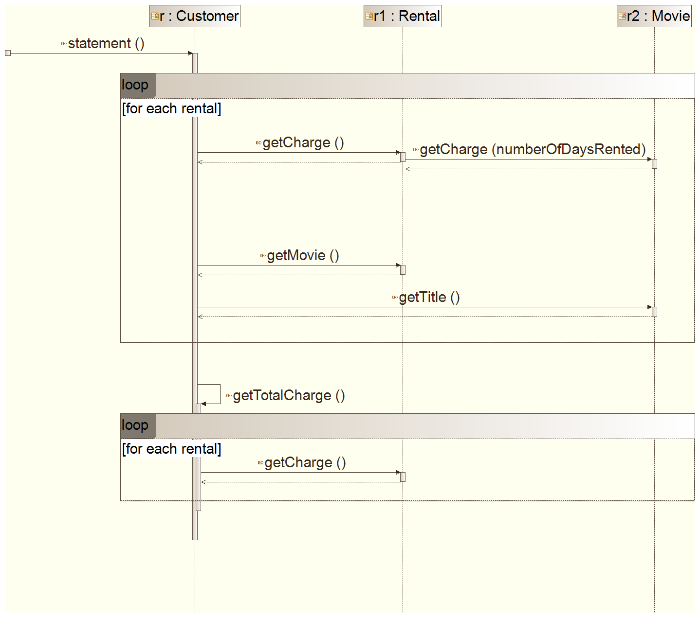
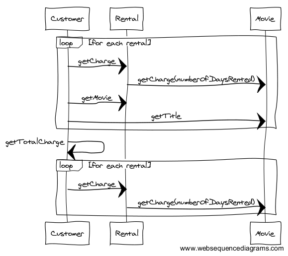

# Déléguer la gestion des règles de tarification à la vidéo

Pour pouvoir faciliter l'ajout de nouveaux types de vidéos, et de ce fait faciliter la gestion des règles de tarification, nous allons travailler, dans cette partie du tutoriel, autour du code traitant de ce point, c-à-d la **méthode `getCharge`**, en examinant les différents points suivants : 

* [Un problème de conception?](#PbConception)
* [Est-il satisfaisant de simplement déplacer la méthode `getCharge()` vers la classe `Movie`?](#PbSimpleMoveMethod)
* [Déplacer la méthode `getCharge()` vers la classe `Movie` via une délegation dans `Rental` à l'aide de l'IDE](#MoveMethodWithDelegate)
* [Amélioration du refactoring Move Method en cours dans le respect d'une *bonne* conception](#bestRefactoring)

Et nous terminerons par jeter un petit coup d'oeil aux nouveaux diagrammes :

* [Zoom sur les diagrammes UML (classes et séquences) après la délégation du calcul des frais de location d'une vidéo](#diagUML)

## Un problème de conception ? 

Pour commencer, repartons du code de la méthode `getCharge` de la classe `Rental`. Que nous dit-il ?

	public double getCharge() {
		double result = 0;
		switch (getMovie().getPriceCode()) {
		case Movie.REGULAR:
			result += 2;
			if (getDaysRented() > 2) {
				result += (getDaysRented() - 2) * 1.5;
			}
			break;
		case Movie.NEW_RELEASE:
			result += getDaysRented() * 3;
			break;
		}
		return result;
	}

L'instruction `switch (getMovie().getPriceCode())` soulève un problème de conception.
Le `switch` traite l'attribut d'un objet d'une classe autre que celle où il est défini, à savoir un objet de la classe `Movie` (or nous sommes dans la classe `Rental`).

Pourtant un bon principe d'utilisation du `switch` préconiserait qu'il s'applique aux données de l'objet qu'il est sensé manipulé (un objet de la classe où il est utilisé) et pas à celles d'un autre objet.

Il y a donc ici un problème de couplage entre la classe `Movie` et la classe `Rental` et il paraît assez naturel de **déplacer le `switch` (donc la méthode `getCharge`) dans la classe `Movie`.**

**Mais faut-il pour autant supprimer la méthode `getCharge()` de la classe `Rental` ?**

## Est-il satisfaisant de simplement déplacer la méthode `getCharge()` vers la classe `Movie` ?

Si via la fonctionnalité de refactoring **Move Method** de votre IDE (**`ALT+SHIFT+V`** ou menu **`Refactor -> Move...`**) vous essayez de déplacer la méthode `getCharge()` de la classe `Rental` vers la classe `Movie`, voilà ce que vous obtiendrez dans la classe `Customer` pour l'appel de `getCharge` :

	private double getTotalCharge() {
		double totalCharge = 0;
		for (Rental each : rentals) {
			totalCharge += each.getMovie().getCharge(this);
		}
		return totalCharge;

L'instruction `each.getCharge()` devenant à la suite d'un simple Move Method l'instruction : `each.getMovie().getCharge(this);`

#### Quid de l'instruction **`each.getMovie().getCharge(this);`** ?

Cette instruction pose un certain nombre de problèmes :

* **Problème avec le `this`**: l'IDE soulève lui-même l'**erreur de compilation** suivante :
`The method getCharge(Rental) in the type Movie is not applicable for the arguments (Customer)`
Ce n'est donc pas `this` (de type `Movie`) que l'on devrait trouver en paramètre, mais plutôt `each` de type `Rental`, ce qui donnerait plutôt une instruction du genre :
**`each.getMovie().getCharge(each);`** . Ne trouvez-vous pas étrange que `each` reçoive un message dans lequel il est lui même paramètre d'entrée ? Cette instruction n'est donc pas vraiment satisfaisante pour être considéré comme un code *bien refactoré*.

* D'autre part, cette instruction a un chaînage multiple (d'abord appel à un objet de type `Movie` (via `getMovie`) pour ensuite pouvoir appeler `getCharge`). Elle ne respecte pas une règle fondamentale de conception appelée [***Loi de Demeter***](https://fr.wikipedia.org/wiki/Loi_de_D%C3%A9m%C3%A9ter) qui consiste à  ***Ne parlez qu'à ses amis immédiats***.
Pour en savoir plus sur la loi de demeter, vous pouvez jeter un petit coup d'oeil [ici](http://pyxis-tech.com/blog/2012/05/04/connaissez-vous-la-loi-de-demeter/) et [là](http://c2.com/cgi/wiki/LawOfDemeter?LawOfDemeter). 
 

## Déplacer la méthode `getCharge()` vers la classe `Movie` via une délegation dans `Rental` à l'aide de l'IDE 

Pour respecter la loi de demeter dans la classe `Customer`, nous devons conserver un appel direct à `getCharge` depuis le `each`, ce qui signifie que `getCharge` devra être conservé dans la classe `Rental`, mais que son code sera délégué à la classe `Movie`.

Nous pouvons effectuer cette opération de refactoring via l'IDE :

* **en sélectionnant la signature de la méthode devant être déplacée** : ici ce sera  `getCharge()` à sélectionner par exemple dans la Outline.
* **en appelant la fonction de refactoring Move Method** : via (**`ALT+SHIFT+V`**) par exemple.
* **en paramétrant le Move Method** 
	* La **New target** doit être **`Movie`**
	* L'**option `Keep original method as delegate to moved method`** doit être cochée et
	* L'**option `Mark as deprecated`** doit être décoché.

> **Vous venez de faire des modifications dans votre code...**  
> ***N'oubliez pas de relancer les tests pour vérifier que le comportement de votre code n'a pas changé !***

## Amélioration du refactoring Move Method dans le respect d'une *bonne* conception 

Nous allons maintenant examiné une à une les trois classes pour voir si ce refactoring doit être amélioré.

### Zoom sur la classe `Customer`

Le problème de la loi de Demeter est désormais résolu dans la classe `Customer` puisque l'appel à la méthode `getCharge` s'effectue toujours à l'aide de l'instruction suivante : **`each.getCharge()`**.

### Zoom sur la classe `Movie`

#### A propos de la loi de Demeter...
En examinant le code de la méthode `getCharge`, on remarque rapidement que l'instruction
**`switch (rental.getMovie().getPriceCode())`** ne respecte pas la loi de Demeter.

En se focalisant un peu plus sur cette instruction, on remarque `rental.getMovie()` ne renvoie rien d'autre qu'une `Movie`, et comme nous sommes dans la classe `Movie`, cette instruction peut donc simplement s'apparenter à un `this` (que l'on peut ou pas faire apparaître).

Simplifiez donc le `rental.getMovie().getPriceCode()` par un simple 
**`getPriceCode()`** (ou **`this.getPriceCode()`**).

> **Vous venez de faire des modifications dans votre code...**  
> ***N'oubliez pas de relancer les tests pour vérifier que le comportement de votre code n'a pas changé !***

#### Découpler la classe `Movie` de la classe `Rental`...
La méthode `getCharge` prend actuellement en paramètre une location via un objet de la classe `Rental`.    
La méthode utilise ensuite uniquement le nombre de jours de location (obtenu via `rental.getDaysRented()`).

Alors vaut-il mieux passer en paramètre un objet de type `Rental` ou pourrait-on se contenter de passer juste un entier indiquant la durée de la location ?

Dans le contexte de ce refactoring, nous allons opter pour la seconde solution. 
Ce refactoring, étant effectué dans le but de pouvoir modifier facilement le type des vidéos, il est préférable de découpler la classe `Movie` de la classe `Rental` pour minimiser les effets secondaires à traiter lors de ce changement.

Nous effetuerons ce refactoring en plusieurs temps :

* Tout d'abord, nous allons **créer une variable locale `daysRented`** pour ne faire apparaître dans le code qu'un seul appel à la méthode `getDaysRented` : il s'agit d'un refactoring [**Extract Variable**](http://refactoring.com/catalog/extractVariable.html) qui n'est autre que l'inverse du refactoring [**Inline Temp**](http://refactoring.com/catalog/inlineTemp.html). Pour cela, sélectionnez une instruction `rental.getDaysRented()`, puis à l'aide du raccourci (**`ALT+SHIFT+L`**) ou du menu **`Refactor -> Extract Local Variable...`**) procédez à l'extraction de la variable **`daysRented`**

* Puis, nous allons transformer `rental.getDaysRented()` en paramètre d'entrée. Pour cela, sélectionnez `rental.getDaysRented()` puis appellez le menu **`Refactor -> Introduce parameter...`**. Veillez bien à changer le nom du paramètre de `daysRented2` en `daysRented` et à décocher l'option `Keep original method as delegate to moved method`.
Validez, puis cliquez sur `Continue` (de toutes façons nous allons supprimer la ligne juste après).

* Il ne reste plus qu'à faire un peu de ménage et à supprimer :
	* dans la signature de la méthode : `Rental rental`
	* dans le corps de la méthode, l'instruction : `int daysRented = daysRented;`

* et pour une meilleure expressivité du code, renommer le paramètre d'entrée `daysRented` en `numberOfDaysRented` à l'aide d'un (**`ALT+SHIFT+R`**)

afin d'obtenir un code similaire au suivant :

	public double getCharge(int numberOfDaysRented) {
		double result = 0;

		switch (getPriceCode()) {
		case Movie.REGULAR:
			result += 2;
			if (numberOfDaysRented > 2) {
				result += (numberOfDaysRented - 2) * 1.5;
			}
			break;
		case Movie.NEW_RELEASE:
			result += numberOfDaysRented * 3;
			break;
		}
		return result;
	}

*Remarque :* on ne pouvait pas appliquer directement le refactoring **Introduce parameter** sur `rental.getDaysRented()` car ce refactoring ne s'applique que sur l'instruction sélectionnée et dans le code se trouvaient plusieurs instructions de type `rental.getDaysRented()`, ce qui explique pourquoi nous avons dû passer par une variable locale pour centraliser à un seul endroit cette instruction et pour ainsi mener à bien notre refactoring en utilisant les fonctionnalités proposés par l'IDE. Vous auriez tout aussi pu effectuer ce refactoring *à la main*, mais attention aux erreurs...

Nous ne pouvons pas lancer les tests car comme nous venons de modifier la signature de la méthode `public double getCharge(int daysRented)`, il existe désormais une erreur de compilation dans la classe `Rental`

### Zoom sur la classe `Rental`

Pour supprimer l'erreur de compilation, l'appel à la méthode `getCharge` doit désormais prendre en paramètre d'entrée l'attribut `daysRented`.

	public double getCharge() {
		return movie.getCharge(daysRented);
	}

> **Vous venez de faire des modifications dans votre code...**  
> ***N'oubliez pas de relancer les tests pour vérifier que le comportement de votre code n'a pas changé !***

## Zoom sur les diagrammes UML (classes et séquences) après la délégation du calcul des frais de location d'une vidéo 

Et nous terminerons par jeter un petit coup d'oeil aux nouveaux diagrammes de notre projet.

### Zoom sur le diagramme de classes 

La classe `Rental` contient toujours une méthode `getCharge` qui permet de lancer le calcul des frais de location, mais délègue ce calcul à la classe `Movie`.   
En effet, la classe `Movie` contient désormais une méthode `getCharge(int)` qui gère les différentes du système de tarification, permattant ainsi d'introduire plus facilement de nouveaux types de vidéos.

### Zoom sur le diagramme de séquences 

<!--  -->

Le diagramme de séquence montre bien la délégation du calcul des frais de location d'une vidéo.

### Continuez le tutoriel par la [mise en place d'un système de tarification évolutif et modulable grâce au **State Pattern**](refactoring_Step6_StatePattern.md)  