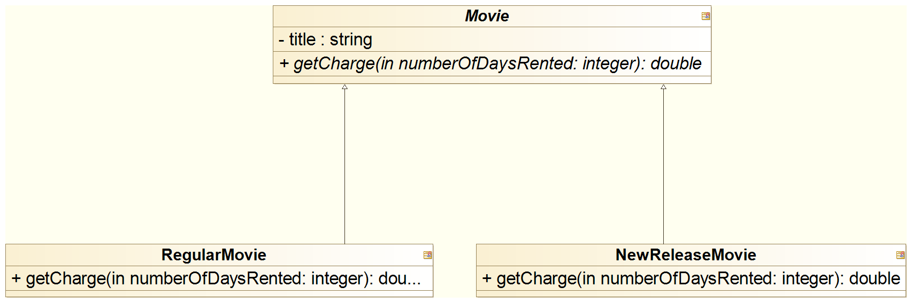
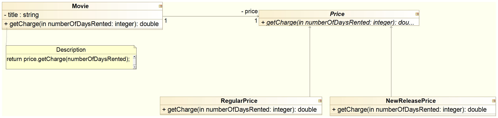
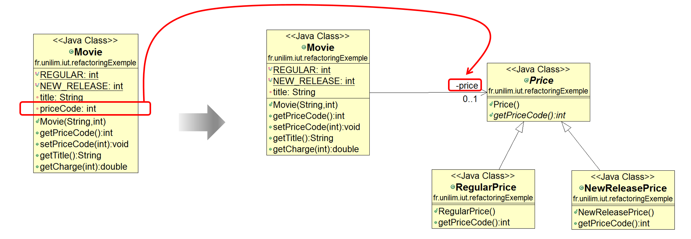
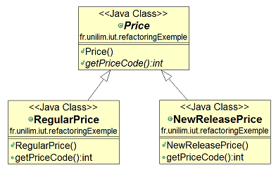
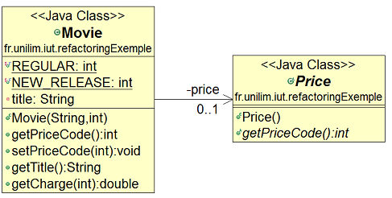
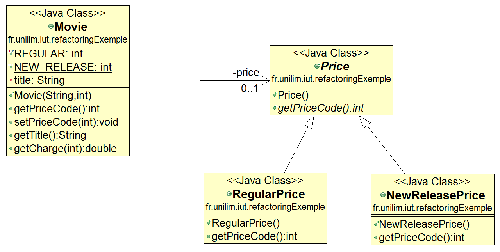
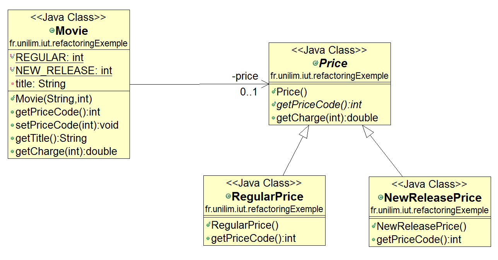
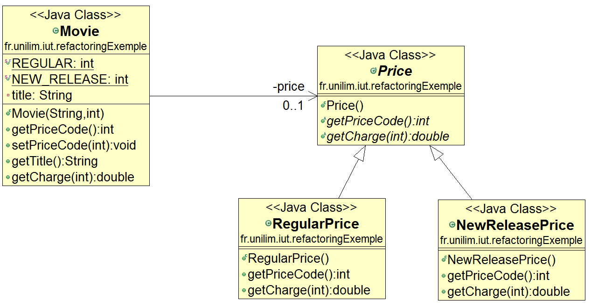
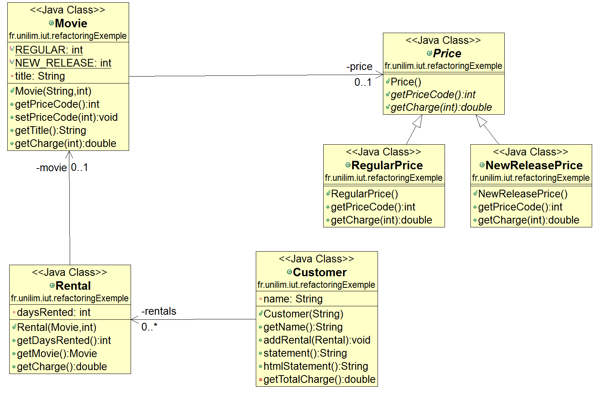
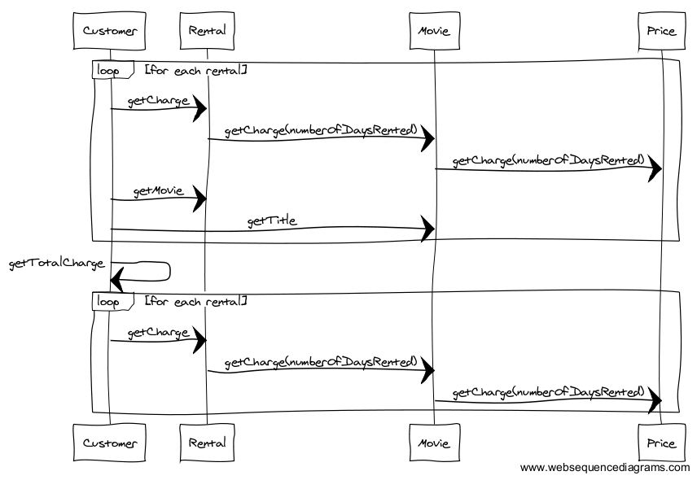

# Mettre en place un système de tarification évolutif et modulable grâce à un **State Pattern**

Rappelons que le client souhaite, dans un futur proche, changer la façon dont il classifie ses vidéos mais qu'il ne connaît pas exactement ce classement.

Nous traitons actuellement deux types de vidéos dans notre code et nous disposons, pour modéliser ces différentes vidéos, d'une seule classe `Movie`. En effet, seule la classe `Movie`
traite et centralise actuellement toutes les règles de calculs des différents tarifs de location proposant ainsi plusieurs réponses possibles à une même question (`getCharge`). 

L'ajout d'un nouveau tarif demande donc pour l'instant une modification de `Movie` et notamment l'ajout de lignes de code supplémentaires dans `getCharge` pour la gestion de la nouvelle règle de calcul. 
Ne serait-il pas plus pertinent pour faciliter l'ajout d'un nouveau tarif que ce soit le tarif lui-même qui soit garant de sa propre règle de calcul ?
Cette contrainte nécessite en réalité la mise en place d'un héritage (une classe dédiée pour chaque tarif) afin que chaque nouveau tarif soit lui-même responsable de la gestion de la règle de calcul de ses frais de location c-a-d dispose de sa propre méthode `getCharge`.

Le premier héritage auquel nous pouvons penser est un héritage sur la classe `Movie` comme le montre le diagramme de classes suivant :

Mais attention ! Rappelez-vous que lors de leur sortie, les vidéos seront considérées comme des nouveautés (`NEW_RELEASE`), puis elles deviendront des vidéos ordinaires (`REGULAR`) au bout d'un certain temps. Cela signifie qu'au cours de leur cycle de vie, les vidéos doivent pouvoir changer de tarifs.  
Cet héritage sur la classe `Movie` ne peut pas fonctionner dans un tel contexte, puisqu'un objet vidéo ne pourra pas changer de tarif au cours de sa durée de vie (une fois instanciée, la vidéo restera de type `RegularMovie` ou de type `NewReleaseMovie`). 

Reprenons donc ce que nous savons sur une vidéo : une vidéo a un **tarif** particulier (*état*) et ses frais de location dépendent de ce tarif.   
Pour mettre en place, un héritage adapté à notre problème, nous allons donc nous appuyer sur un [patron de conception](https://fr.wikipedia.org/wiki/Patron_de_conception) bien connu : le **patron d'Etat** ou [**State Pattern**](https://sourcemaking.com/design_patterns/state). **Ce patron permet à un objet de modifier son comportement lorsque son état interne change.**  
*Remarque:* Vous verrez en détail les design patterns l'année prochaine dans le *module M3105 : Conception et programmation objet avancées*. 
  
Le diagramme de classes suivant propose une implémentation possible du State Pattern dans notre contexte de video (`Movie`).  

L'héritage fait apparaître 2 nouvelles classes `RegularPrice` et `NewReleasePrice` qui représentent les différents états possibles que peut avoir un tarif (`Price`), un attribut de vidéo (`Video`). Il facilite ainsi les changements de classification à venir puisque : 

* Ajouter un nouveau tarif de vidéo reviendra simplement à ajouter un nouvel état c-a-d ajouter une nouvelle classe fille à la classe `Price` 
* Modifier l'état de la vidéo pourra être réalisé à tout moment dès lors que la classe `Movie` disposera d'un setteur sur l'attribut de type `Price`

En vue de la mise en place de ce nouveau système de tarification évolutif et modulable, l'implémentation du **State Pattern** précédent va s'organiser autour de trois grandes étapes de refactoring :

* [Créer un nouveau système de tarification à base d'états (**`Replace Type Code with State/Strategy`)**](#ReplaceTypeCodeWithState)
* [Déléguer le calcul des frais de location au système de tarification (**`Move Method`**)](#MoveMethodGetCharge)
* [Inciter chaque tarif à être responsable du calcul de ses propres frais de location (**`Replace Conditional with Polymorphism`**)](#ReplaceConditionalwithPolymorphism)

Et nous terminerons par jeter un petit coup d'oeil  :

* [Zoom sur la couverture de code](#couverture)
* [Zoom sur les diagrammes UML (classes et séquences) après le State Pattern](#diagUML)

## Mettre en place un nouveau système de tarification à base d'états (**`Replace Type Code with State/Strategy`**)

Pour mettre en place notre nouveau système de tarification à base d'états, nous aurons besoin de transformer le tarif (actuellement traité dans la classe `Movie` comme ***entier***) en ***état*** (une instance de la classe `Price`) en mettant en place l'architecture suivante :

Cette transformation n'est autre que le refactoring **`Replace Type Code with State/Strategy`** décrit par Martin Fowler à l'adresse suivante : [http://refactoring.com/catalog/replaceTypeCodeWithStateStrategy.html](http://refactoring.com/catalog/replaceTypeCodeWithStateStrategy.html) (et [ici](https://sourcemaking.com/refactoring/replace-type-code-with-state-strategy) sous Source Making) 

Il préconise son usage lorsque :

> You have a type code that affects the behavior of a class, but you cannot use subclassing.

Et propose de le mettre en place de la manière suivante :

> **Replace the type code with a state object.**

Nous allons donc mettre en place notre nouvelle architecture en deux étapes :

* [Création d'un système de tarification via un héritage de tarifs](#Heritage)
* [Association d'un tarif à une vidéo](#Association)

### Création d'un système de tarification via un héritage de tarifs 

La première étape du refactoring vers le **State Pattern** consiste à créer les 3 nouvelles classes `RegularPrice` et `NewReleasePrice` et `Price`.

Pour le calcul des frais de location, notre programme nécessite à moment donné de connaitre le type de la vidéo, ce qui se fait pour l'instant dans la méthode `getCharge` au travers de la méthode `getCodePrice`.

Faire connaître le code du prix à appliquer est semble-t-il un service que devrait proposer la classe `Price` : la méthode `getPriceCode` devenant alors de la responsabilité de la classe `Price`. Abstraite dans la classe `Price`, elle ne sera réellement implémentée que dans les classes *concrètes* de prix `RegularPrice` et `NewReleasePrice` où elle permettra (pour l'instant) de renvoyer respectivement les types `REGULAR` et `NEW_RELEASE`.

Il ne vous reste plus qu'à implémenter les 3 classes `Price`, `RegularPrice` et `NewReleasePrice` conformément au digramme précédent. Vous devriez obtenir un code similaire au suivant :

	public abstract class Price {
		public abstract int getPriceCode();
	}  
 
	
	public class RegularPrice extends Price {
		@Override
		public int getPriceCode() {
			return Movie.REGULAR;
		}
	}

	public class NewReleasePrice extends Price {
		@Override
		public int getPriceCode() {
			return Movie.NEW_RELEASE;
		}
	}

*Remarque:* Il n'est pas nécessaire de relancer les tests puisque nous n'avons pas pour l'instant toucher au code existant.

### Association d'un tarif à une vidéo 

L'attribut `priceCode` permet de connaitre le tarif à appliquer à une vidéo.
Nous devons donc maintenant relié ce tarif à notre nouveau système de tarification pour pouvoir calculer les frais de location d'une vidéo, ce qui revient à associer la classe `Movie` à la classe `Price` de la manière suivante :

Au niveau du code, cela signifie que vous allez devoir déclarer **`price` comme un attribut de `Price`**.  
L'attribut `price` va ainsi coupler la classe `Movie` à la classe `Price`. Une bonne pratique de refactoring recommande, dans ce cas, d'accéder uniquement à cet attribut via des getteurs/setteurs. Ce refactoring s'appelle **Self Encapsulate Field** et est décrit par Martin Fowler à l'adresse suivante : [http://refactoring.com/catalog/selfEncapsulateField.html](http://refactoring.com/catalog/selfEncapsulateField.html) (et sous SourceMaking [ici](https://sourcemaking.com/refactoring/self-encapsulate-field)).
Il préconise son usage lorsque :

> You are accessing a field directly, but the coupling to the field is becoming awkward.

Et propose de le mettre en place de la manière suivante :

> **Create getting and setting methods for the field and use only those to access the field.**

Nous allons donc commencer par mettre en place du refactoring **Self Encapsulate Field** avant de procéder à l'association des deux classes.

#### *Self Encapsulate Field* sur `priceCode`

Pour mettre en place le refactoring **Self Encapsulate Field** dans la classe `Movie`, il suffit donc simplement de remplacer l'instruction :  `this.priceCode = priceCode;` par un appel au setteur : **`setPriceCode(priceCode);`**

*Remarque:* `priceCode` est utilisé une seule fois dans le constructeur. 

> **Vous venez de faire une petit modification dans votre code...**  
> ***N'oubliez pas de relancer les tests pour vérifier que le comportement de votre code n'a pas changé !***

#### Mise en place de l'association entre les classes `Movie` et `Price`

Nous allons maintenant procéder à l'association de la classe `Movie` et de la classe `Price` c-a-d permettre à la `Movie` de disposer d'un tarif de type `Price`. Cette modification va avoir un impact sur la déclaration de l'attribut `priceCode`, mais aussi ses getteurs/setteurs. 

##### Déclaration d'un tarif de type `Price`
Associer la classe `Movie` à la classe `Price` revient donc à déclarer **`priceCode` comme un attribut de type `Price`**. Effectuez cette modification dans votre code.  
Vous constatez alors que vous pouvez améliorer l'expressivité de votre code en renommant l'attribut `priceCode` en  `price` à l'aide d'un (**`ALT+SHIFT+R`**) par exemple ; la déclaration du second attribut de la classe `Movie` devenant ainsi : **`private Price price;`**

Vous constatez alors que ce changement de type a provoqué des erreurs de compilation au niveau des méthodes `setPriceCode` et `getPriceCode`.

##### Modification de `getPriceCode`

Pour supprimer l'erreur de compilation dans le getteur, il suffit d'appeler la méthode `getPriceCode` de la classe `Price`.
Vous obtenez alors un code similaire au suivant :

	public int getPriceCode() {
		return price.getPriceCode();
	}

#####  Modification de `setPriceCode`

Ce setteur nous permet de changer le tarif de la `Video` en fonction du type de vidéos passé en paramètre.
Un tarif étant désormais une instance de `Price`, un nouveau tarif spécifique doit donc être créé pour un type de vidéos spécifique.
Pour cela, nous allons utiliser un `switch` et proposer le code suivant :

	public void setPriceCode(int priceCode) {
		switch (priceCode) {
		case REGULAR:
			price = new RegularPrice();
			break;
		case NEW_RELEASE:
			price = new NewReleasePrice();
			break;
		default:
			throw new IllegalArgumentException("Incorrect Price Code");
		}
	}

Il n'y a désormais plus d'erreurs de compilation et comme...

> **Vous venez de faire des modifications dans votre code...**  
> ***N'oubliez pas de relancer les tests pour vérifier que le comportement de votre code n'a pas changé !***

A la fin de ce refactoring, nous disposons dorénavant d'un code correspondant au diagramme de classes suivant :

## Déléguer la gestion de la règle de calcul des frais de location au système de tarification (**`Move Method`**)

Avec cette nouvelle conception, ne serait-il pas plus approprié que la gestion de la règle de calcul des frais de localisation soit de la responsabilité du système de tarification plutôt que de la responsabilité de la vidéo ?

Pour ce faire, nous allons devoir déléguer encore une fois la méthode `getCharge`, mais cette fois-ci ce sera la classe `Price` (et sa hiérarchie) qui en sera responsable.    
La méthode `getCharge` va donc devoir être déplacée dans la classe `Price` tout en laissant une délégation dans la classe `Movie`. Comme précédemment, nous pouvons effectuer ce refactoring **Move Method**, via Eclipse de la manière suivante :  

Sélectionnez la méthode `getCharge` de la classe `Movie`(par exemple dans la vue Outline), puis appelez le **Move Method** (`Refactor -> Move Method...` ou `ALT+SHIFT+V`) et veillez bien à ce que la classe cible soit **Price** et que l'option **`Keep original method as delegate to moved method`** soit  cochée.

> **Vous venez de faire des modifications dans votre code...**  
> ***N'oubliez pas de relancer les tests pour vérifier que le comportement de votre code n'a pas changé !***

En fait, le refactoring automatique via Eclipse a créé un paramètre d'entrée de type `Movie` pour pouvoir appeller la méthode `getPriceCode`. Ce paramètre n'est pas nécessaire puisque la classe `Price` dispose de sa propre méthode `getPriceCode` (appelé dans le `getPriceCode` de `Movie`)
Modifiez donc la méthode `getCharge` en ce sens dans la classe `Price` (finalement un simple copiez-collez depuis `Movie` aurait suffit...) et son appel dans la classe `Movie`.

	public abstract class Price {
		public abstract int getPriceCode();

		public double getCharge(int numberOfDaysRented) {
		double result = 0;
	
		switch (getPriceCode()) {
		case Movie.REGULAR:
			result += 2;
			if (numberOfDaysRented > 2) {
				result += (numberOfDaysRented - 2) * 1.5;
			}
			break;
		case Movie.NEW_RELEASE:
			result += numberOfDaysRented * 3;
			break;
			}
		return result;
		}
	}

Dans la classe `Movie`, on se retrouve avec :

	public double getCharge(int numberOfDaysRented) {
		return price.getCharge(numberOfDaysRented);
	}

> **Vous venez de faire des modifications dans votre code...**  
> ***N'oubliez pas de relancer les tests pour vérifier que le comportement de votre code n'a pas changé !***

Le diagramme de classes est désormais le suivant :

Maintenant le calcul des frais de location a bien été délégué au système de tarification, il ne reste plus que faire en sorte que chaque tarif soit lui-même responsable du calcul de ses propres frais de location.

## Faire en sorte chaque tarif soit responsable de la règle de calcul de ses propres frais de location (`Replace Conditional with Polymorphism`)

Permettre à chaque tarif de calculer lui-même ses propres frais de location revient à redéfinir une méthode `getCharge` dans chaque classe fille de notre héritage et, ainsi mettre en place un polymorphisme sur `getCharge`.

### Redéfinition de la méthode `getCharge` dans la classe `RegularPrice`

Implémentez dans la classe `RegularPrice` une redéfinition de la méthode `getCharge`, dont le code est un simple copier\coller du `case Movie.REGULAR:` de la méthode `getCharge`.   
N'oubliez pas de déclarer `result` comme variable locale et de renvoyer le résultat.

	@Override
	public double getCharge(int numberOfDaysRented) {
		double result = 2;
		if (numberOfDaysRented > 2) {
			result += (numberOfDaysRented - 2) * 1.5;
		}
		return result;
	}

Pour l'instant, ne touchez pas au code de la classe `Price`, mais vérifiez que votre programme a toujours le même comportement...

> **Vous venez de faire des modifications dans votre code...**  
> ***N'oubliez pas de relancer les tests pour vérifier que le comportement de votre code n'a pas changé !***

### Redéfinition de la méthode `getCharge` dans la classe `NewReleasePrice`

De la même manière, implémentez dans la classe `NewReleasePrice` une redéfinition de la méthode `getCharge` relative au `case Movie.NEW_RELEASE:`

	@Override
	public double getCharge(int numberOfDaysRented) {
		return numberOfDaysRented * 3;
	}

> **Vous venez de faire des modifications dans votre code...**  
> ***N'oubliez pas de relancer les tests pour vérifier que le comportement de votre code n'a pas changé !***

### Mise en place d'un polymorphisme *propre* dans la classe `Price`

#### Visualisation du bon fonctionnement du polymorphisme via la couverture

Avant de procéder à une quelconque modification dans la classe `Price`, nous allons lancer une couverture de code et voir comment cette couverture se comporte quant à la méthode `getCharge`.

* La couverture sur la méthode `getCharge` de la classe `RegularPrice` est totale.
* La couverture sur la méthode `getCharge` de la classe `NewReleasePrice` est totale.
* Il n'y a aucune couverture sur la méthode `getCharge` de la classe `Price`.

Ces résultats sont rassurants et montrent le bon fonctionnement du polymorphisme lors de l'appel à `getCharge` sur un objet de type `Price` (le code exécuté étant bien celui de la classe ayant servi pour l'instanciation). 

#### Impact du polymorphisme sur le code de la méthode `getCharge` de la classe `Price`

Le code de la classe `getCharge` de la classe `Price` ne sera donc jamais exécuté.  
On peut donc supprimer ce code et même passer la méthode `getCharge` en méthode abstraite, la classe `Price` se résumant alors à :

	public abstract class Price {
		public abstract int getPriceCode();
		public abstract double getCharge(int numberOfDaysRented);
	}

> **Vous venez de faire des modifications dans votre code...**  
> ***N'oubliez pas de relancer les tests pour vérifier que le comportement de votre code n'a pas changé !***

### Zoom sur le refactoring **`Replace Conditional with Polymorphism`**
En redéfinissant la méthode `getCharge` dans les classes filles `RegularPrice` et `NewReleasePrice`, nous venons de mettre en place un **polymorphisme** qui nous a permis de supprimer la **condition** (sous forme de `switch`) présente dans la classe mère `Price`.  

Ce refactoring est connu sous le nom de **Replace Conditional with Polymorphism**. Martin Fowler décrit ce refactoring à l'adresse suivante : [http://refactoring.com/catalog/replaceConditionalWithPolymorphism.html](http://refactoring.com/catalog/replaceConditionalWithPolymorphism.html) (et [ici](https://sourcemaking.com/refactoring/replace-conditional-with-polymorphism) sous Source Making).   

Il préconise son usage lorsque :

> You have a conditional that chooses different behavior depending on the type of an object.

Et propose de le mettre en place de la manière suivante :

> **Move each leg of the conditional to an overriding method in a subclass. Make the original method abstract.**

## Zoom sur la couverture de code  

Lancez la couverture. La **Coverage View** nous permet de faire un petit bilan :

* La classe `Customer` est couverte à 100% 
* La classe `Rental` est couverte à 85.7% (seul le getteur de `daysRented` n'est pas couvert) 
* La classe `Movie` est couverte à 78.0% (le getteur de `price` et l'exception en cas de tarif incorrect ne sont pas couverts) 
* La classe `Price` est couverte à 100.0% 
* La classe `RegularPrice` est couverte à 90.5% (seul le getteur n'est pas couvert)
* La classe `NewReleasePrice` est couverte à 80.0% (seul le getteur n'est pas couvert)

Le taux de couverture du code source du projet est 94.1%, ce qui est satisfaisant puisque seuls les getteurs et l'exception de ne sont pas couverts.

Les tests sont toujours au vert, ce qui signifie que le refactoring n'a bien eu aucun impact quant au comportement de notre programme !

## Zoom sur les diagrammes UML (classes et séquences) après le State Pattern 

Grâce à la mise en place d'un pattern d'Etat, tout semble désormais prêt pour ajouter/modifier de nouveaux tarifs et créer facilement un nouveau système de tarification adapté aux besoins de client.

### Zoom sur le diagramme de classes après le State Pattern

### Zoom sur le diagramme de séquences après le State Pattern

<!--  -->

C'est bien le tarif (`Price`) qui est responsable de la règle de calcul des frais de location ...

### Continuez le tutoriel par [quelques remarques imagées sur l'intention du code et les commentaires](commentaires.md)  

