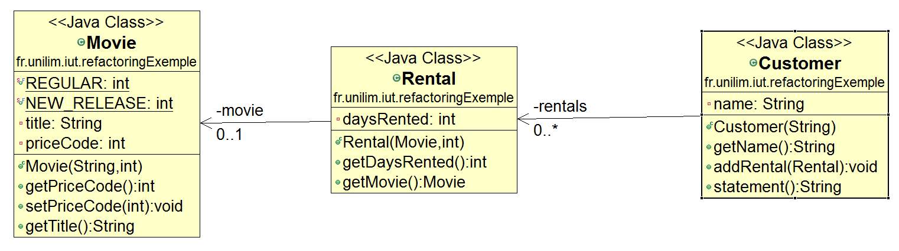
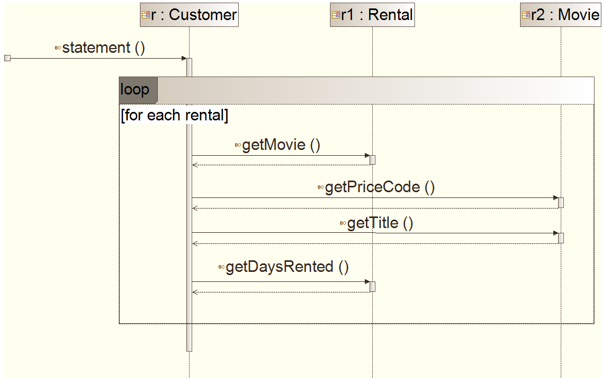

# Découverte du refactoring : Présentation de l'exemple à refactorer

L'exemple sur lequel se base ce refactoring est un programme destiné à calculer et afficher le relevé de compte des locations d'un client d'un vidéo-club.

Cette partie du tutoriel traite :

* [Import du projet de l'exemple](#importProjet)
* [Zoom sur le projet](#zoomProjet)
* [Un petit coup d'oeil sur le diagramme de séquence de la méthode `statement`](#diagSequence)
* [Commentaires sur le programme](#commentaires)
* [Roadmap pour la mise en place de nouvelles spécifications dans le respect d'une *bonne* conception](#roadmap)

## Import du projet de l'exemple 

Lors du refactoring, nous allons utiliser, sous Eclipse le plug-in [ObjectAid UML Explorer](http://www.objectaid.com/) pour visualiser rapidement le diagramme de classes généré automatiquement à partir du code Java écrit.

Un tutoriel sur ObjectAid UML Explorer est disponible [ici](https://github.com/iblasquez/tuto_ModelisationUML/tree/master/ObjectAid), il vous permettra à la fois d'installer [ObjectAid UML Explorer](http://www.objectaid.com/) et de récuperer les sources nécessaires à ce tutoriel.

Toutefois, si vous n'utilisez pas Eclipse ou si vous ne souhaitez pas installer [ObjectAid UML Explorer](http://www.objectaid.com/), vous pouvez récupérer directement les sources dans le répertoire [`src`](src) ci-dessus et créer un projet que vous appelerez `refactoringExemple`.

## Zoom sur le projet 

Le projet `refactoringExemple` est donc constitué de 3 classes :

* une classe `Customer` pour le client
* une classe `Movie` pour la vidéo
* une classe `Rental` pour la location

Consultez le code de ces classes. 
Le projet étant simple, vous devriez pouvoir facilement répondre aux questions suivantes :
Que fait ce code ? et Quelles sont les règles métiers ?

[Via ObjectAid](https://github.com/iblasquez/tuto_ModelisationUML/tree/master/ObjectAid), vous disposez déjà du diagramme de classes qui devrait vous aider à comprendre plus facilement le code :

### Que fait ce code ? Quelles sont les règles métiers ? 
Le code de ce projet est destiné à **calculer** et à **afficher** le relevé de compte (*`statement`*) d'un client (*`Customer`*) d'un magasin de location (*`Rental`*) de vidéos (*`Movie`*).

La méthode `statement` procède au calcul et à l’affichage du relevé des frais de location d'un compte client.  
Le relevé de compte (au format ASCII) est présenté de la manière suivante :  

* Nom du client
* Détails de chaque vidéo en cours de location : titre et montant des frais de location propre à cette vidéo (calculé à partir du tarif spécifique et du nombre de jours de location).
* Montant récaptitulatif correspondant au total de tous les frais de locations en cours.

Lors de leur sortie, les vidéos sont considérées comme des nouveautés (**`NEW_RELEASE`**), puis elles deviennent des vidéos ordinaires (**`REGULAR`**) au bout d'un certain temps. 
Un système de tarification a donc été établi en tenant compte de ces différents types possibles de location (`REGULAR` ou `NEW_RELEASE`). Il applique, pour l’instant, les règles de calcul suivantes :

* La **location d'une vidéo ordinaire (`REGULAR`)** revient à 2 Euros pour les deux premiers jours de location, puis 1.5 Euros pour chaque jour de location supplémentaire
* La **location d'une vidéo considérée comme une *nouveauté* (`NEW_RELEASE`)** revient à 3 Euros pour chaque jour de location. 

Il est à noter qu'au cours de leur vie, les vidéos seront amenées à changer de type (notamment en passant de *nouveauté* à *ordinaire*), et donc de tarif (`priceCode`) : ce qui explique la présence de la méthode `setPrice` dans la classe `Movie``.

## Un petit coup d'oeil sur le diagramme de séquence de la méthode `statement` 

Afin de se familiariser avec le code et de mieux visualiser les interactions entre les objets du programme, représentons le diagramme de séquence de la méthode **`statement`** :

<!--  -->
<!-- Link to this image mais non updaté ... -->

Ainsi, pour chaque location (`Rental`) de video (`Movie`), la méthode `statement` recherche le tarif de la vidéo louée(`getPriceCode`)  et le nombre de jours de location de cette vidéo (`getDaysRented`) afin de calculer les frais de location.
Un relevé de compte (au format ASCII) est généré : il contient pour chaque vidéo : son titre (`getTitle`) et ses frais de location, et se conclue par le montant total de tous les frais de locations.

## Commentaires sur le programme 

Avez-vous remarqué de la *complexité* de la méthode `statement` de la classe `Customer`: certains traitements ne devraient-ils pas plutôt être délégués à d'autres classes ?

Peut-être pensez-vous néanmoins que ce programme est simple...
  
Néanmoins même si ce programme est écrit dans un langage Orienté Objet, ce programme n'est pas forcément bien conçu pour pouvoir répondre rapidement au changement de spécification (ajout de nouvelles fonctionnalités, modification du système de tarification,...) et s'éloigne d'une **C**onception **O**rientée **O**bjet "**simple**" (au sens de **[Simple Design](http://martinfowler.com/bliki/BeckDesignRules.html)**).

Pour l'instant l'affichage du relevé de compte des frais de location n'est possible qu'au format **ASCII** et tout va bien...  
...Mais voilà,  nous venons justement de recevoir une nouvelle demande des utilisateurs. Ils souhaitent désormais que **le relevé de compte (*`statement`*) puisse également être disponible au format HTML.** ...

#### Quel est à votre avis l'impact de cette nouvelle spécification sur le code ?
En l'état actuel du code, il semble difficile de ré-utiliser le comportement de l'actuelle méthode `statement` (calcul **et** affichage du relevé au format ASCII) pour y introduire le comportement d'un `HTML statement`.  
La solution la plus facile à mettre en place à partir de ce code serait d'écrire une nouvelle méthode `htmlStatement` en copiant/collant la méthode `statement` et en procédant aux changements dus au format d'affichage.

#### Mais que se passearait-il si les règles métiers venaient à changer ?
Il serait alors nécessaire de procéder aux mêmes modifications à la fois dans la méthode `statement` et dans la méthode `htmlStatement` et de s'assurer que ces modifications garantissent bien le comportement attendu du système...
...Ce qui soulève le problème lié à la **duplication** de code (copier-coller) c-a-d maintenir une cohérence du système et son comportement face à de nouveaux changements...

## Roadmap pour la prise en place de nouvelles spécifications dans le respect d'une *bonne* conception 

Alors, **comment doit-on procéder pour mettre en place un affichage au format HTML (en plus de l'affichage déjà existant au format ASCII)** , et ce dans le respect d'une conception *simple* s'adaptant facilement aux changements ?

Martin Fowler dans [Refactoring, Improving the Design of Existing Code](http://martinfowler.com/books/refactoring.html) propose de suivre la règle suivante :

> **When you find you have to add a feature to a program, and the program's code is not structured in a convenient way to add the feature, first refactor the program to make it easy to add the feature, then add the feature.**

Pour ajouter à notre programme la nouvelle spécification ***Afficher le relevé de compte au format HTML***, nous respecterons ces préconisations en mettant en place les deux étapes suivantes :

#### D'abord un refactoring permettant de préparer l'ajout de la nouvelle fonctionnalité

* [Mise en place des tests unitaires](refactoring_Step0_miseEnPlaceTests.md)
* [Isoler le calcul du montant des frais d'une location, de l'affichage du relevé (à l'aide d'un **`Extract method`**)](refactoring_Step1_ExtractMethod.md)
* [Rendre la classe `Rental` responsable du calcul des frais de location (à l'aide d'un **`Move method`**)](refactoring_Step2_MoveMethod.md)
* [Isoler le calcul de la somme des frais de toutes les locations de l’affichage du relevé (à l'aide d'un **`Replace Temp with Query`**)](refactoring_Step3_ReplaceTempWithQuery.md)  

#### Puis l'ajout de la nouvelle fonctionnalité 

* [Mettre en place le nouvel affichage au format HTML via la méthode `htmlStatement`](refactoring_Step4_Ajout_htmlStatement.md) 

Une fois cette fonctionnalité ajoutée, nous procéderons à un nouveau refactoring pour pouvoir répondre rapidement et en toute confiance à une nouvelle demande du client, celle de pouvoir dans un futur proche modifier la manière dont il classifie les vidéos en disposant d'un système de tarification évolutif et modulable.

Pour cela, nous procéderons donc également à ...

#### Un dernier petit refactoring en 2 etapes :

* [Déléguer la gestion des règles de tarification à la vidéo](refactoring_Step5_DeleguerGetCharge.md)

* [Mettre en place un système de tarification évolutif et modulable grâce au **State Pattern**](refactoring_Step6_StatePattern.md)  

### Continuez le tutoriel par [pas de refactoring sans tests!](refactoring_Step0_miseEnPlaceTests.md)  
